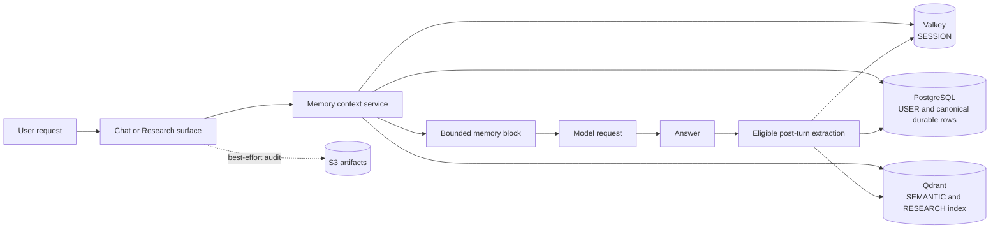
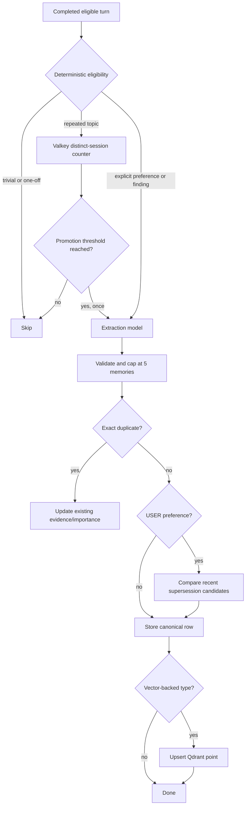
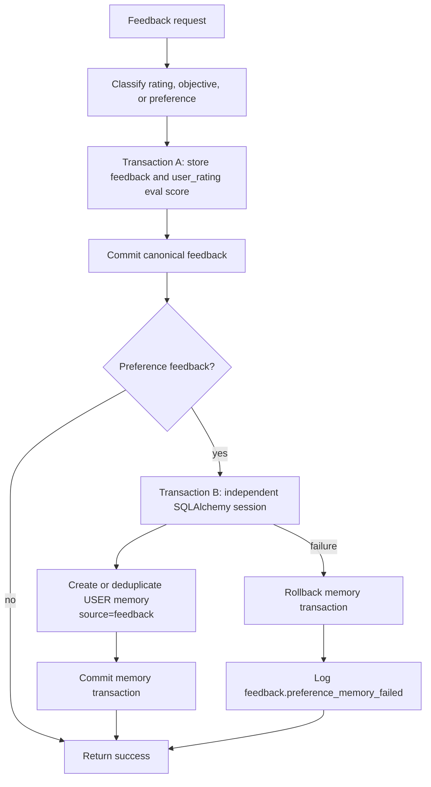
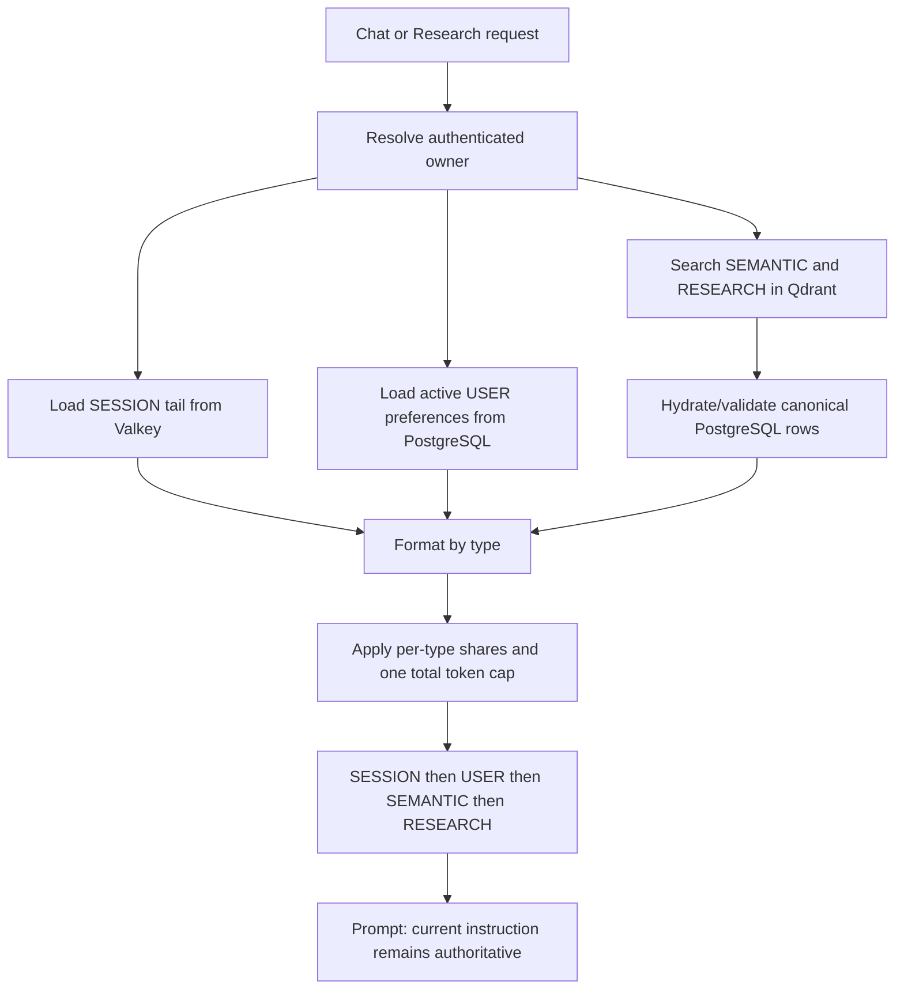
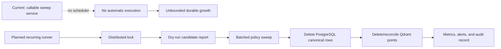
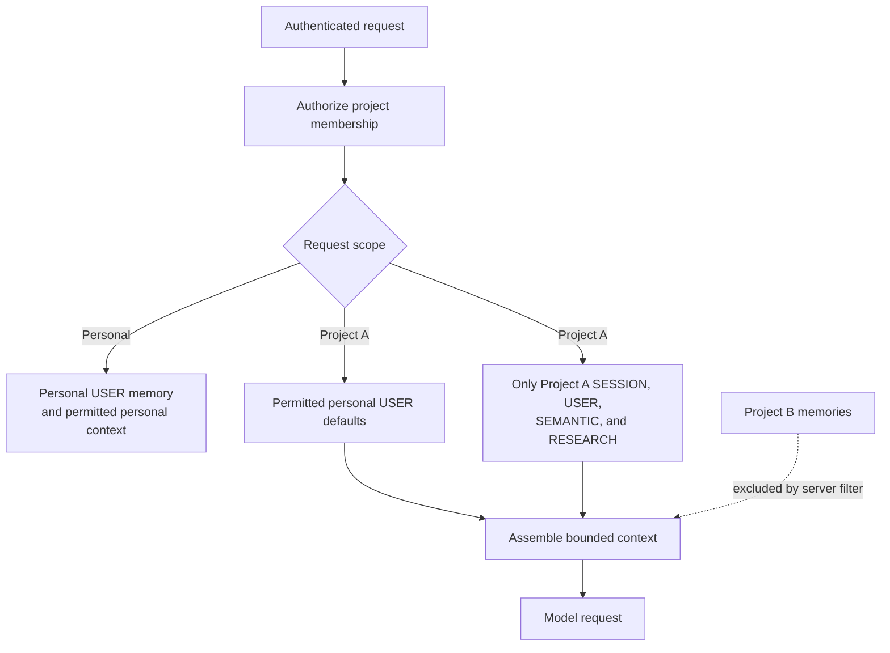
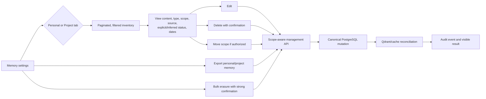
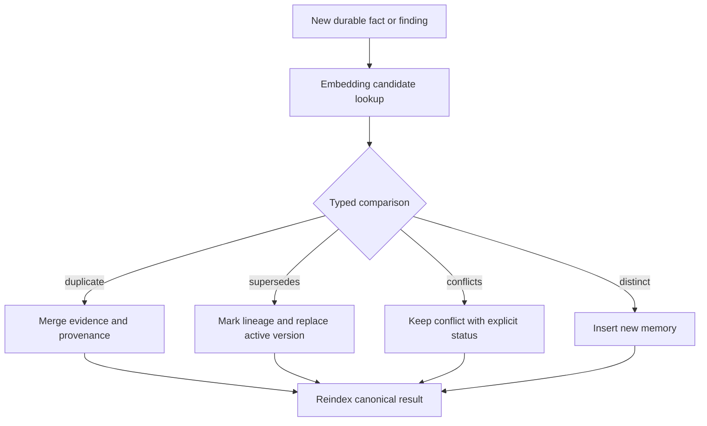

# ResearchMind Memory Management Summary

**Status:** Living architecture and delivery summary  
**Last reconciled:** 2026-08-17  
**Implementation progress:** M0-M2, M4, and M5 foundation complete; M3 rollout
pending; personal-only slices of M12-M13 shipped early

This document explains the existing and planned ResearchMind memory platform in
one place. It is an orientation document, not a replacement for the accepted
[memory architecture](architecture/memory-platform.md), the executable
[prioritized task list](MEMORY_PLATFORM_PRIORITIZED_TASKS.md), or the
[manual regression guide](MEMORY_MANUAL_TEST.md).

Status and ordering follow
[the prioritized memory backlog](MEMORY_PLATFORM_PRIORITIZED_TASKS.md). The
repository-wide wave placement follows
[the prioritized roadmap](PRIORITIZED_ROADMAP.md). The Phase 2/3 roadmap and
North Star supply rationale and long-term domain direction; they do not
override memory acceptance criteria. M5's isolation foundation is now in place,
while the full Project schema remains the Wave 3 anchor for
typed research objects and Research Paths.

## 1. Goals and non-goals

ResearchMind memory should make later answers more useful without silently
turning every conversation into permanent data. The production design is guided
by five outcomes:

1. Preserve useful session state, durable preferences, facts, and research
   findings.
2. Keep memories isolated by owner and, before Projects launches, by project.
3. Bound storage, prompt tokens, write volume, latency, and model cost.
4. Let users see, correct, export, and delete what ResearchMind remembers.
5. Measure whether memory improves answer quality and detect regressions before
   release.

Full archival tiers, reflection/episodic memory, organization-wide shared
memory, agent memory, and memory-driven request routing are explicitly deferred.

## 2. Executive status

| Area | Existing today | Planned target |
|---|---|---|
| Memory types | SESSION, USER, SEMANTIC, RESEARCH with explicit personal/project scope | Activate project scope from Project-aware runtimes |
| Session state | Scope-safe Valkey keys, seven-day TTL, compact state by default | Capacity telemetry and tested expiry behavior |
| Durable storage | PostgreSQL canonical rows; Qdrant for vector retrieval | Lifecycle scheduling, reconciliation, quotas, consolidation |
| Capture | Post-turn extraction, repeated-interest promotion, feedback preferences | Evaluated extraction, stronger supersession, optional typed preferences |
| Retrieval | Four product surfaces share one coordinated token budget; scope-safe services are implemented | Activate authorized project context in Project-aware runtimes |
| Write safety | Public mutation limits and payload bounds; internal circuit breaker | Per-plan quotas, load tests, operational alerts |
| Feedback safety | Canonical feedback commits before isolated memory write | Durable outbox only if delivery guarantees justify it |
| User controls | Single-record create/read/update/delete | Paginated inventory, Personal/Project UI, export, bulk erasure, confirmations |
| Lifecycle | Recurring, batched, locked worker implemented; report-only by default | Validate staging dry runs, enable conservative deletion, and monitor production cadence |
| Quality | Unit/component coverage; no memory eval program | Offline retrieval and answer-utility gates plus sampled online signals |
| Observability | Operation counters/timers and rate-limit metrics | Absolute size, drift, lifecycle, token, utility, and alert dashboards |

## 3. Memory model

| Type | Purpose | Canonical store | Retention today | Retrieval behavior |
|---|---|---|---|---|
| SESSION | Active conversation state and compact summaries | Valkey | Seven-day TTL | Newest capped tail, displayed oldest-to-newest |
| USER | Durable preferences and user-specific facts | PostgreSQL | Indefinite | Recent active preferences, exact dedup, supersession |
| SEMANTIC | Reusable facts and topics | PostgreSQL | Indefinite | Qdrant similarity search with threshold |
| RESEARCH | Durable findings with research provenance | PostgreSQL | Indefinite | Qdrant similarity search with threshold |

PostgreSQL is authoritative for durable memory. Qdrant is a derived search
index, not a second source of truth. Valkey owns ephemeral session state and
short-lived extraction/rate-limit counters. S3 memory artifacts are best-effort
audit evidence and are not canonical storage.

Raw turn storage is disabled by default. Compact session state is enabled. This
reduces storage and prompt cost while avoiding unnecessary retention of full
conversation text.

## 4. Existing architecture



Memory injection is active in:

- Chat.
- Linear Research.
- Deep Research proposal generation.
- Deep Research execution.

All memory content is untrusted context. It can inform an answer but must not
override the current user instruction, authorization checks, or system policy.

## 5. Existing capture and write flows

### 5.1 Post-turn extraction



An internal per-owner extraction circuit breaker currently permits 60 eligible
extraction calls per hour by default. A confirmed denial skips both the model
call and memory write. Valkey failure is fail-open for this internal optimization
so the main answer flow remains available. Extraction output is capped at five
memories per turn.

USER supersession compares against the 20 most recently touched preferences.
This works for common changes but can miss an old, dormant contradiction; M9
replaces this recency-only window with topic-relevant candidate retrieval.

### 5.2 Feedback-derived preferences (M0 complete)



The separate transaction is the essential production invariant: memory failure
cannot poison or roll back the already committed feedback and evaluation score.
This is intentionally fail-open for the optional memory side effect. A durable
outbox remains a future option if guaranteed eventual memory delivery becomes a
business requirement.

### 5.3 Public mutation protection (M2 complete)

The public `POST /memory` and `PUT /memory/{id}` operations share a per-owner
`memory_write` limit of 30 requests per minute by default. `DELETE /memory/{id}`
uses an independent limit of 10 requests per minute. Confirmed over-limit
requests return `429` with `Retry-After`. Reads, context assembly, and search do
not consume mutation quota.

Memory content is limited to 10,000 characters. Encoded metadata is limited to
16 KiB and nesting depth six. Accepted, rejected, and failed mutation outcomes
are emitted with bounded operation labels. Public limiter dependency failures
fail closed to prevent unbounded writes.

## 6. Existing retrieval and prompt assembly



Each type retains an item cap of five. SEMANTIC and RESEARCH results use vector
similarity thresholds. On-demand memory search can combine type results; normal
context assembly preserves deterministic type order. M4 applies one coordinated
budget to the complete memory block, including headings, precedence text,
whole-entry selection, and omission reporting; entries are omitted intact
rather than truncated mid-fact.

The SESSION ordering defect is fixed (M1): cap selection chooses the newest
items, then renders that selected window chronologically. Older messages are not
allowed to displace newer state merely because presentation order is ascending.

## 7. Existing APIs and user-control gap

Existing endpoints support creating memory, searching, assembling context, and
single-record read/update/delete. They do not provide a paginated inventory,
bulk export, bulk erasure, or a Personal/Project memory management experience.
Deletion also has no product-level confirmation flow today.

Owner checks must be enforced server-side on every read and mutation. Client
metadata is never a trusted authorization boundary.

## 8. Existing lifecycle and scale gap

`MemoryLifecycleService.sweep_stale()` can remove low-importance,
stale USER, SEMANTIC, and RESEARCH rows and corresponding Qdrant points. Its
current default policy uses a 90-day age and importance at or below 0.3.

The dedicated `apps.worker.memory_lifecycle_main` process now invokes the sweep
on a configurable cadence. It defaults to report-only, uses a Valkey singleton
lock, processes bounded type-specific batches, isolates row failures, and emits
lifecycle health metrics. Production growth is not yet bounded until staging
dry runs are reviewed and deletion is explicitly enabled; that rollout evidence
is the remaining M3 acceptance criterion.



## 9. Project isolation foundation (M5)

Project isolation landed before Projects stores memory. Scope is a
first-class, indexed field—not opaque metadata—with `scope_type` and nullable
`project_id` carried through PostgreSQL, Qdrant payloads, Valkey keys, caches,
idempotency keys, metrics, and S3 audit artifacts.



Implemented rules:

- USER memory is personal/global by default; project-specific preferences are
  allowed only when explicitly scoped.
- SESSION, SEMANTIC, and RESEARCH created in a project are project-scoped.
- A Project A request may receive permitted personal USER defaults plus Project
  A memory, never Project B memory.
- Project deletion must define whether memories are erased, exported, or moved
  according to an explicit retention policy.
- Integration tests must prove cross-project and cross-owner leakage is
  impossible on every API, retrieval, cache, and background path.

## 10. User-visible memory management (M12-M15)

The first personal-memory slice shipped early on 2026-08-17: `/memory` is a
first-class authenticated view backed by paginated `GET /memory`. It supports
debounced content search, feedback-source filtering, accurate totals,
validated inline edits, and a product-native confirmed delete flow. It shows
USER memory only and remains owner-scoped. Project Memory is visibly deferred
until the Project/workspace product supplies an authorized project context;
M5's authorization and storage isolation boundary is implemented.

The diagram below includes both this shipped personal slice and the remaining
M5/M12-M15 target:



The UI should distinguish user-entered memories from inferred memories and show
provenance without exposing hidden model reasoning. Users should be able to
correct inaccurate content and disable categories or inference where supported.
Bulk erasure must include canonical rows, vectors, caches, and derived artifacts
with an auditable completion result.

## 11. Planned bounded lifecycle and consolidation (M3, M8-M10)

M3 adds recurring execution, type-specific policies, dry-run/report-only mode,
batching, distributed locking, bounded retries, metrics, alerts, and PostgreSQL ↔
Qdrant reconciliation. SESSION continues to rely primarily on TTL. Durable
memory policy will vary by type rather than applying one blunt age threshold.

M8 prevents SEMANTIC and RESEARCH memory from becoming a noisy set of
near-duplicates:



Consolidation must preserve provenance and reversibility. Similar embeddings
alone are not sufficient evidence to merge facts. M9 improves USER preference
supersession with topic-aware candidates; M10 gradually adds optional typed
preference fields while retaining readable text for prompting and migration.

## 12. Planned total prompt budget (M4)

The context builder will receive one model-aware token budget shared by all
memory types. Allocation policy must be deterministic, observable, and leave
reserved room for the current instruction, retrieved documents, tool output,
and answer generation. Lower-value items are truncated or omitted before
higher-priority relevant items. Metrics record tokens used, items omitted, and
the reason for omission.

This makes the cost/latency/accuracy trade-off explicit:

- **Cost:** fewer input tokens and fewer unnecessary extraction calls.
- **Latency:** bounded reads, vector queries, rendering, and prompt size.
- **Accuracy:** relevant recent preferences and evidence survive before stale or
  weakly matched content.

## 13. Planned evaluation loop (M6-M7)

```mermaid
flowchart LR
    D[Versioned memory eval dataset] --> R[Retrieval evaluation]
    R --> K[Recall@K, Precision@K, MRR/nDCG,<br/>scope leak, stale/conflict rates]
    D --> A[Paired answer runs: memory on vs off]
    A --> J[Answer utility, grounding, instruction adherence]
    K --> G[Release gate]
    J --> G
    G --> P[Production rollout]
    P --> O[Privacy-safe sampled online signals]
    O --> E[(eval_scores and dashboards)]
    E --> D
```

Evaluation must include helpful, irrelevant, stale, contradictory, and
cross-scope examples. Retrieval quality alone is insufficient: paired answer
tests must show whether injected memory improves the final response without
hurting grounding or current-instruction adherence. Online scoring is sampled,
bounded, redacted, and must never block the user response.

## 14. Observability target (M11)

Current operation metrics are useful but incomplete. Production dashboards and
alerts will add:

- Canonical row count and storage bytes by type and scope.
- Qdrant point count, indexing failures, and PostgreSQL/Qdrant drift.
- Accepted/rejected mutation counts and rate-limit denials.
- Extraction skips, circuit-breaker denials, and extraction output counts.
- Supersession, consolidation, conflict, and duplicate rates.
- Lifecycle candidates, deleted rows, duration, failures, and last success.
- Memory tokens injected, items omitted, retrieval latency, and utility signals.
- Export/erasure completion and reconciliation failures without sensitive
  content in labels or logs.

Metric dimensions must remain bounded; owner IDs, project IDs, and free-text
memory content must not become metric labels.

## 15. Failure and consistency policy

| Failure | Required behavior |
|---|---|
| Context retrieval fails | Preserve the main Chat/Research flow where safe; record bounded diagnostics |
| Optional extraction fails | Do not fail an already produced answer |
| Feedback preference write fails | Preserve committed feedback/eval score; rollback isolated memory transaction |
| Public rate limiter is unavailable | Fail closed for mutations to prevent unbounded writes |
| Internal extraction limiter is unavailable | Fail open so the main flow remains usable |
| Qdrant indexing fails after canonical write | Keep PostgreSQL authoritative; retry/reconcile and expose drift |
| Lifecycle job overlaps | Distributed lock prevents concurrent sweeps |
| Scope cannot be proven | Deny access; never broaden to personal/all-project memory |
| Bulk erasure partially fails | Report incomplete state and retry reconciliation; never claim completion early |

## 16. Delivery plan

| Order | Task | Status | Primary outcome |
|---:|---|---|---|
| 1 | M0 feedback transaction isolation | Complete | Feedback remains durable when memory fails |
| 2 | M1 SESSION ordering | Complete | Newest context selected and rendered chronologically |
| 3 | M2 mutation limits and payload bounds | Complete | Bounded public writes and internal extraction cost |
| 4 | M3 scheduled lifecycle | Implemented; rollout pending | Validate dry runs, enable deletion, and monitor cadence |
| 5 | M4 total token budget | Complete | Bound prompt cost and context crowding |
| 6 | M5 project scope | Foundation complete; Project runtime activation pending | Prevent cross-project memory leakage |
| 7 | M6 memory evaluation | Implementation complete; staging calibration pending | Seed staging, capture live retrieval and paired answers, human-calibrate the judge/budgets, and enforce the live deployment gate |
| 8 | M7 online quality signals | Implemented; rollout/calibration pending | Generation correlation, explicit memory feedback, and opt-in sampled utility/harm scoring |
| 9 | M8 evidence-driven consolidation | Implemented; rollout/evaluation gate pending | Bounded vector nomination, typed decisions, reversible lineage, and fail-safe re-indexing |
| 10 | M9-M10 preference quality | Planned | Remove supersession misses and gradually type common preferences |
| 11 | M11 observability | Partially present; expansion planned | Make size, health, drift, and utility visible |
| 12 | M12-M13 management API and UI | Partial personal slice shipped | Owner-scoped USER listing, search/source filter, pagination, editing, and confirmed deletion are live; Project Memory and broader controls remain |
| 13 | M14-M15 export, erasure, confirmation | Planned | Governance and safe destructive actions |
| 14 | M16 hardening | Ongoing/planned | Load, failure-mode, prompt-safety, and capacity confidence |

The authoritative acceptance criteria and dependencies for every item remain in
[MEMORY_PLATFORM_PRIORITIZED_TASKS.md](MEMORY_PLATFORM_PRIORITIZED_TASKS.md).

## 17. Production invariants

Every implementation and review should preserve these invariants:

1. The current user instruction outranks remembered content.
2. Authentication and authorization precede retrieval; scope filters are
   server-derived and fail closed.
3. PostgreSQL is canonical for durable memory; vector and cache state is
   reconcilable.
4. Optional memory work cannot break the main Chat, Research, or feedback flow.
5. Public mutation volume, payload size, extraction calls, prompt tokens, and
   lifecycle batch size are bounded.
6. No free text, owner ID, or project ID appears in metric labels.
7. Destructive actions are confirmed, auditable, and honest about partial
   completion.
8. New retrieval or extraction behavior ships only with accuracy, latency, and
   cost measurements plus memory-on/off regression coverage.

## 18. Verification references

- Run the focused automated tests attached to each M-task before the broader
  Chat and Research suites.
- Follow [MEMORY_MANUAL_TEST.md](MEMORY_MANUAL_TEST.md) for the current M0-M4
  end-to-end checks. M3 is safe-by-default in dry-run mode and still requires
  a production rollout decision before deletion is enabled.
- Use [PRODUCTION_READINESS_EVALUATION.md](../PRODUCTION_READINESS_EVALUATION.md)
  for the repository-wide production bar.
- Treat [architecture/memory-platform.md](architecture/memory-platform.md) as
  the detailed accepted design and update it when implementation changes a
  contract described here.
