# ResearchMind AI Current Implementation: Full End-to-End Flow

**Code snapshot reviewed:** 2026-07-28  
**Scope:** Current executable paths in `apps/web`, `apps/api`, and `apps/worker`.  
**Notation:** Solid arrows are synchronous calls or direct control flow. Dotted arrows are asynchronous, best-effort, external, or event-stream interactions.

This document is code-derived. It describes what the current implementation does, including validation, decisions, retries, approval pauses, bounded loops, persistence, and failure paths. Historical roadmap items and scaffold-only packages are not shown as active runtime behavior.

## 1. Whole-system map

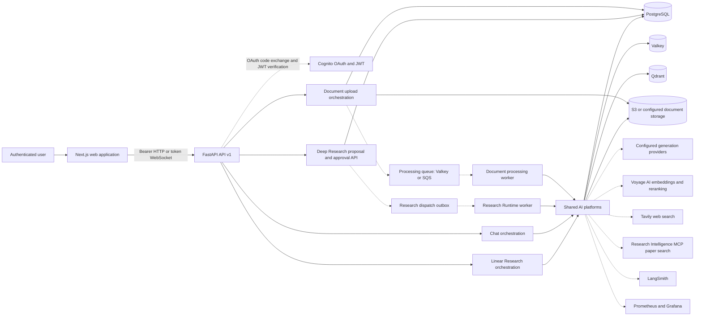

## 2. Application startup, request envelope, and authentication

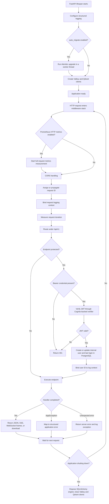

The Cognito callback is a separate public flow: the frontend supplies an authorization code and redirect URI, the API validates Cognito configuration, optionally adds PKCE and client-secret authentication, exchanges the code at Cognito `/oauth2/token`, and returns the token response or a mapped authentication error.

## 3. Document ingestion and asynchronous indexing

### 3.1 Upload request

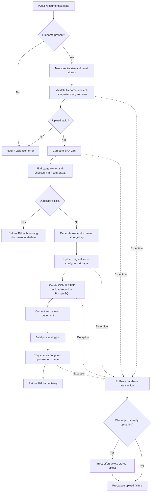

### 3.2 Processing worker, pipeline, retry, and dead-letter behavior

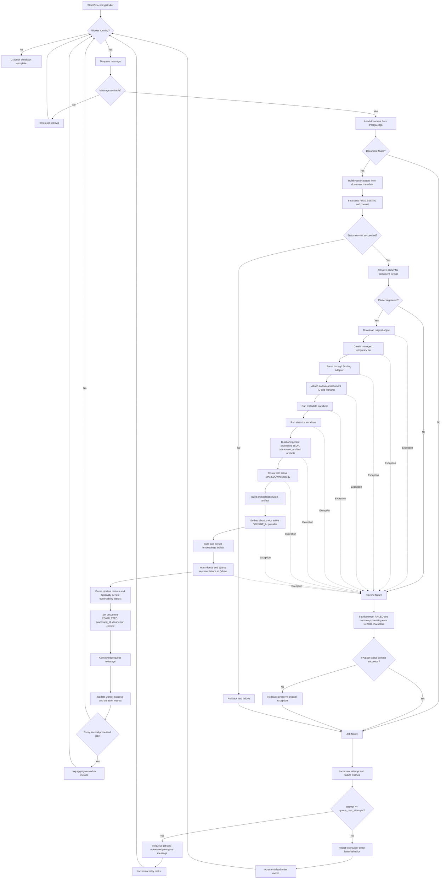

## 4. Shared retrieval and context-building pipeline

This pipeline is used by Linear Research, Deep Research task retrieval, citations preview, and the explicit retrieval endpoints. Chat deliberately does not call it.

```mermaid
flowchart TD
    query["Owner-scoped RetrievalQuery"] --> validate["Validate non-empty query, maximum length, and top_k"]
    validate --> valid{"Valid?"}
    valid -->|No| error["Raise retrieval validation error"]
    valid -->|Yes| normalize["Trim and collapse whitespace"]
    normalize --> pool["Expand candidate top_k to min(requested x 5, 50)"]
    pool --> parallel["Run three searches concurrently"]
    parallel --> dense["Dense query embedding and Qdrant dense search"]
    parallel --> sparse["Sparse SPLADE query embedding and Qdrant sparse search"]
    parallel --> metadata["Metadata-filtered search without query embedding"]
    dense --> fusion["Reciprocal Rank Fusion"]
    sparse --> fusion
    metadata --> fusion
    fusion --> fused["Take requested top_k"]
    fused --> rerank{"Reranking enabled, service configured, and chunks exist?"}
    rerank -->|Yes| voyage["Voyage AI rerank and replace ordering"]
    rerank -->|No| retrievalResult["Build HYBRID RetrievalResult and timings"]
    voyage --> retrievalResult

    retrievalResult --> contextChunks["Convert retrieved chunks to ContextChunk"]
    contextChunks --> platformGuard{"Platform retrieval guardrails configured?"}
    platformGuard -->|Yes| evaluateGuard["Evaluate source trust, access, sanitization, and citation checks"]
    platformGuard -->|No| dedup
    evaluateGuard --> blocked{"Guardrails blocked?"}
    blocked -->|Yes| guardError["Raise GuardrailBlockedError"]
    blocked -->|No| dedup["Deduplicate"]
    dedup --> parent["Expand hierarchical parents when referenced"]
    parent --> merge["Merge adjacent chunks"]
    merge --> order["Order context"]
    order --> redundancy["Embedding-redundancy compression"]
    redundancy --> langchain{"LangChain contextual compression enabled and query present?"}
    langchain -->|Yes| contextual["Contextual compression"]
    langchain -->|No| budget
    contextual --> budget["Token-budget compression to 6000 tokens"]
    budget --> chunkGuard["Rule-based chunk guardrails filter suspicious or malicious chunks"]
    chunkGuard --> citations["Build canonical citations"]
    citations --> format["Format prompt context"]
    format --> result["Return ContextResult with chunks, citations, warnings, and statistics"]
```

## 5. Chat end-to-end flow

Chat is conversational and memory-aware. Its `PromptContext.chunks` is always empty, so uploaded documents are not retrieved for this surface. Web and paper searches are independent opt-in external augmentations.

```mermaid
flowchart TD
    input["Chat composer submits message"] --> transport{"Transport?"}
    transport -->|HTTP| bearer["POST /chat/stream with Bearer token"]
    transport -->|WebSocket| ws["Connect /chat/ws?token= then send one JSON payload"]
    bearer --> auth["Authenticate and sync user"]
    ws --> auth
    auth --> limit["Check per-owner Chat rate limit"]
    limit --> limited{"Rate limited?"}
    limited -->|HTTP| http429["Return 429 and Retry-After"]
    limited -->|WebSocket| ws1013["Close with 1013"]
    limited -->|No| conversation["Get existing owner conversation or create one"]
    conversation --> identity["Best-effort persist immutable conversation identity artifact"]
    identity --> compact["Compact older history if prompt budget exceeded"]
    compact --> history["Load summary plus recent messages"]

    history --> webToggle{"Web search enabled and available?"}
    webToggle -->|No| paperToggle
    webToggle -->|Yes| webNeed["Run AUTO web-search necessity decision"]
    webNeed --> webNeeded{"Search needed?"}
    webNeeded -->|No| paperToggle
    webNeeded -->|Yes| webSearch["Emit started event; call Tavily; normalize evidence"]
    webSearch --> webEvidence{"Usable web evidence?"}
    webEvidence -->|Yes| webContext["Emit completed with source metadata; format web context"]
    webEvidence -->|No or error| webSkip["Emit skipped; continue without web context"]
    webContext --> paperToggle
    webSkip --> paperToggle

    paperToggle{"Paper search enabled and MCP available?"}
    paperToggle -->|No| memory
    paperToggle -->|Yes| distill["Distill academic query using prompt and recent conversation context"]
    distill --> paperSearch["Emit started; call MCP search_papers"]
    paperSearch --> papers{"Results exist?"}
    papers -->|Yes| paperContext["Emit completed with papers; format paper context"]
    papers -->|No or error| paperSkip["Emit skipped; continue without paper context"]
    paperContext --> memory
    paperSkip --> memory

    memory["Best-effort retrieve session, semantic, and research memory"] --> request["Build transcript and GenerationRequest"]
    request --> noDocs["Set chunks empty; prepend memory, web, and paper context"]
    noDocs --> generation["Shared streaming generation runtime"]
    generation --> cache{"Runtime cache hit?"}
    cache -->|Yes| replay["Replay cached answer as START, synthetic TOKEN chunks, COMPLETE; record zero-cost usage"]
    cache -->|No| live["Stream provider events as canonical SSE or WebSocket events"]
    replay --> completed
    live --> streamError{"Stream error?"}
    streamError -->|Yes| errorEvent["Emit ERROR; do not persist completed turn"]
    streamError -->|No| completed["Completion event observed"]

    completed --> persistTurn["Append user and assistant messages in PostgreSQL"]
    persistTurn --> memoryWrite["Best-effort update session state or raw turn; extract durable memories"]
    memoryWrite --> titleClaim["Claim one-time title generation"]
    titleClaim --> titleWon{"Claim acquired and first question exists?"}
    titleWon -->|Yes| titleGenerate["Generate short uncached Groq title and persist it"]
    titleWon -->|No| artifact
    titleGenerate --> artifact["Best-effort persist immutable conversation-turn artifact if policy allows"]
    artifact --> render["Frontend renders Markdown and source chips"]
```

## 6. Linear Research end-to-end flow

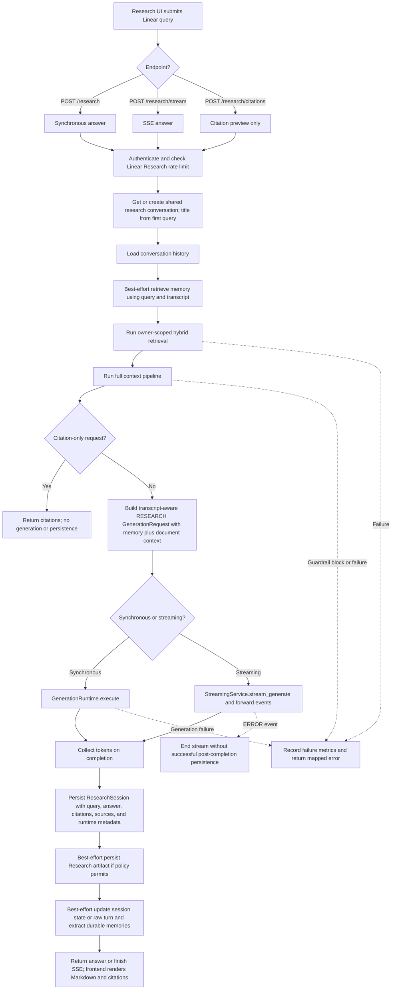

## 7. Shared generation runtime

### 7.1 Non-streaming generation

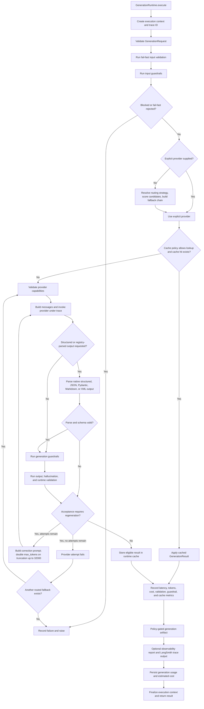

### 7.2 Streaming generation

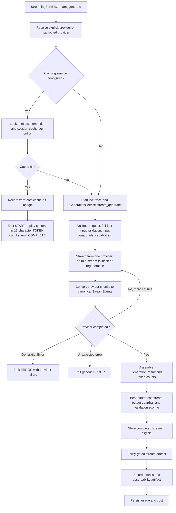

## 8. Deep Research end-to-end flow

### 8.1 Proposal, explicit approval, queue admission, and worker dispatch

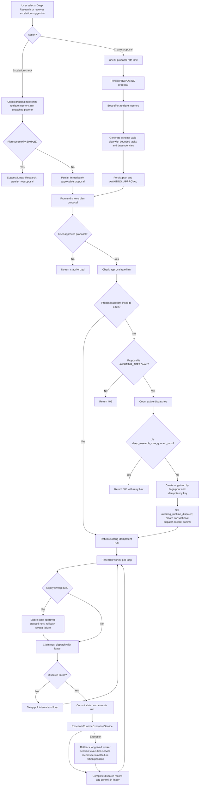

### 8.2 Multi-wave graph with decisions, approvals, and bounded loops

```mermaid
flowchart TD
    begin["Load approved proposal and refresh durable run"] --> terminal{"Run already COMPLETED?"}
    terminal -->|Yes| replay["Replay persisted outcome"]
    terminal -->|No| resume{"Paused status?"}
    resume -->|Report approval| resumeReport["Read recorded report decision and resume checkpoint"]
    resume -->|Plan approval| resumePlan["Read recorded plan decision and resume checkpoint"]
    resume -->|Web-search approval| resumeWeb["Read recorded web decision and resume checkpoint"]
    resume -->|Fresh run| checkCancel["Check cancellation; mark IN_PROGRESS; publish start events"]
    resumeReport --> reportDecision
    resumePlan --> planDecision
    resumeWeb --> webApproved
    resumeWeb --> postApproved
    checkCancel --> cancelled{"Cancellation requested?"}
    cancelled -->|Yes| cancel["Mark CANCELLED and publish event"]
    cancelled -->|No| waves["Validate dependency DAG and calculate topological task waves"]

    waves --> prepare["Prepare current wave"]
    prepare --> fanout["Fan out all ready tasks concurrently"]
    fanout --> taskRetrieve["Each task runs owner-scoped hybrid retrieval and context building"]
    taskRetrieve --> taskResult["Return completed or failed task result with compact evidence"]
    taskResult --> advance["Fan in and advance wave index"]
    advance --> moreWaves{"More dependency waves?"}
    moreWaves -->|Yes| prepare
    moreWaves -->|No| aggregate["Aggregate task results; build and persist immutable evidence artifact"]

    aggregate --> webMode{"Web search mode enabled and service available?"}
    webMode -->|No| planApproval
    webMode -->|Yes| webNeed["Evaluate evidence relevance and web-search necessity"]
    webNeed --> needsWeb{"Usable suggestion and budget remains?"}
    needsWeb -->|No| planApproval
    needsWeb -->|Yes| webAuthorization{"REQUIRED or auto-approved?"}
    webAuthorization -->|Yes| webSearch
    webAuthorization -->|No| webApproval["Interrupt: await human web-search approval"]
    webApproval --> webApproved{"Approved?"}
    webApproved -->|Yes| webSearch["Call Tavily; normalize evidence; record success or failed synthetic task"]
    webApproved -->|No| planApproval["Interrupt: await human plan approval"]
    webSearch --> reaggregate["Merge web task into evidence and persist revised evidence artifact"]
    reaggregate --> planApproval

    planApproval --> planDecision{"Approved?"}
    planDecision -->|No| endNoDraft["End without synthesis; mark terminal"]
    planDecision -->|Yes, optional edited goal| synthesize["Generate schema-bound research draft from evidence"]
    synthesize --> synthesisOk{"Synthesis succeeded?"}
    synthesisOk -->|No, retry budget remains| retrySynthesis["Retry once through bounded regeneration path with correction"]
    retrySynthesis --> synthesize
    synthesisOk -->|No, budget exhausted| failed["Mark FAILED and publish event"]
    synthesisOk -->|Yes| review["Deterministic citation/completeness review plus optional bounded model review"]
    review --> verdict{"Review decision"}

    verdict -->|FAIL| failed
    verdict -->|PASS| reportApproval
    verdict -->|FINALIZE_WITH_LIMITATIONS| reportApproval
    verdict -->|REVISE_SYNTHESIS| repairBudget{"Iteration and estimated-cost budgets remain?"}
    repairBudget -->|Yes| revision["Set revision instructions and increment synthesis revision count"]
    revision --> synthesize
    repairBudget -->|No| limitations["Convert to FINALIZE_WITH_LIMITATIONS"]
    limitations --> reportApproval

    verdict -->|RESEARCH_GAPS| gapBudget{"Iteration and estimated-cost budgets remain?"}
    gapBudget -->|No| limitations
    gapBudget -->|Yes, web enabled| postWebNeed["Evaluate targeted web-search need"]
    gapBudget -->|Yes, web disabled| docGap["Create one targeted gap task and increment plan version"]
    postWebNeed --> postSuggestion{"Web suggestion produced?"}
    postSuggestion -->|No| docGap
    postSuggestion -->|Yes, authorized| postWebSearch["Search web and add synthetic gap task"]
    postSuggestion -->|Yes, approval required| postWebApproval["Interrupt: await human web-search approval"]
    postWebApproval --> postApproved{"Approved?"}
    postApproved -->|Yes| postWebSearch
    postApproved -->|No| docGap
    docGap --> gapRetrieve["Run document retrieval for targeted gap"]
    postWebSearch --> gapAggregate
    gapRetrieve --> gapAggregate["Merge gap evidence and persist revised evidence artifact"]
    gapAggregate --> synthesize

    reportApproval["Interrupt: show editable draft and await report approval"] --> reportDecision{"Approved?"}
    reportDecision -->|No| publishPlain["Skip PDF but publish synthesized draft as plain answer"]
    reportDecision -->|Yes, optional edited draft| report["Persist Markdown report and PDF"]
    report --> papers{"Related-paper suggestions enabled and MCP available?"}
    papers -->|Yes| paperQuery["Distill query and call MCP with timeout"]
    papers -->|No| publish
    paperQuery --> paperResult{"Results returned?"}
    paperResult -->|Yes| paperEvent["Publish related-paper completion event"]
    paperResult -->|No or error| paperSkip["Publish skipped event; never fail report"]
    paperEvent --> publish["Publish reviewed report into shared conversation"]
    paperSkip --> publish
    publishPlain --> publish
    publish --> memoryWrite["Best-effort session-state update and memory extraction"]
    memoryWrite --> complete["Mark run COMPLETED and publish completion event"]

    prepare -.->|Cancellation observed| cancel
    synthesize -.->|Cancellation observed| cancel
    runtimeBudget["Duration or execution budget exceeded"] -.-> failed
```

### 8.3 Approval resume and event delivery

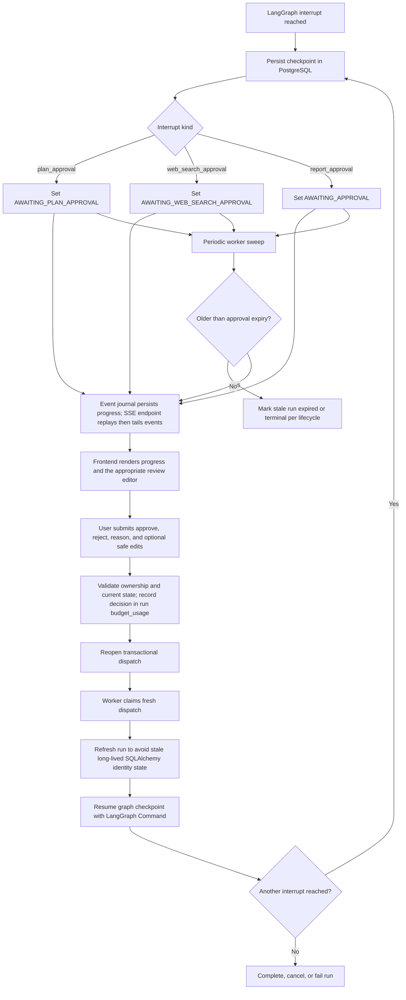

## 9. Memory read/write lifecycle

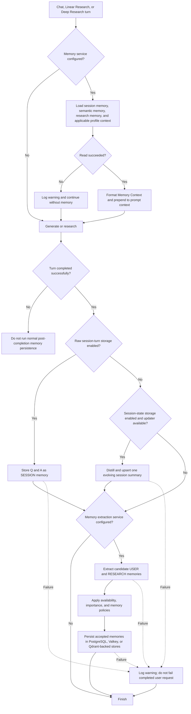

The explicit `/memory` API additionally supports remember, search, context retrieval, recall by ID, update, and forget, with authenticated owner scoping.

## 10. Persistence, cache, artifacts, and observability fan-out

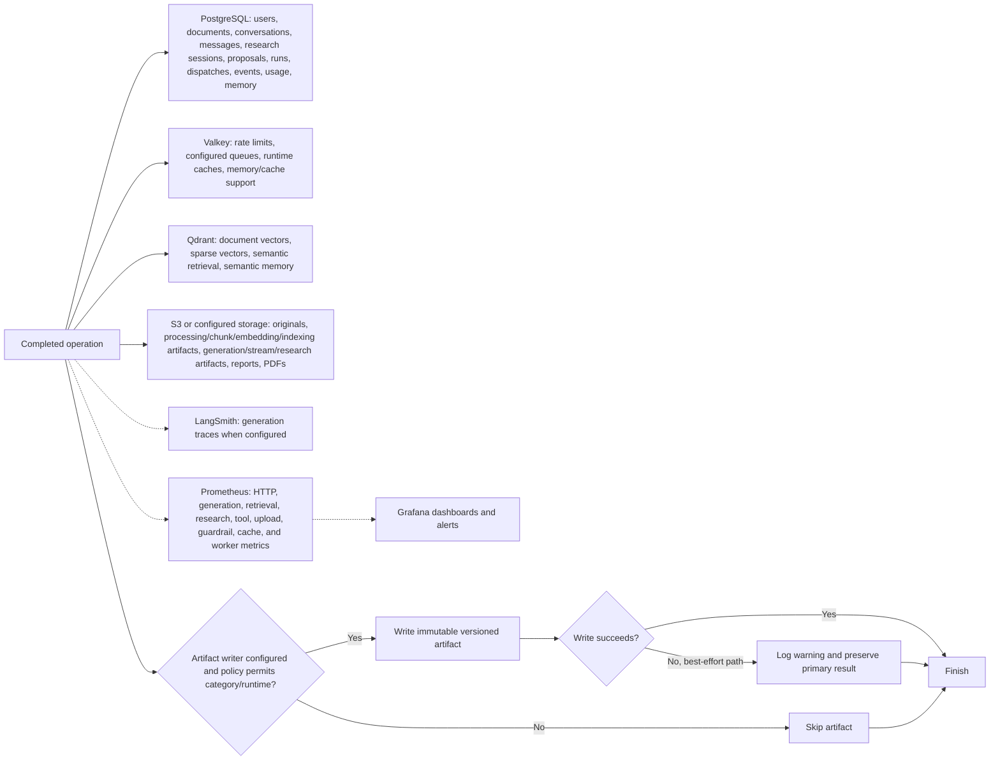

## 11. User-facing API surface represented in the flows

| Area | Current active endpoints |
|---|---|
| Authentication | `POST /auth/callback`, `GET /auth/me` |
| Documents | `GET /documents`, `GET /documents/knowledge-stats`, `POST /documents/upload` |
| Retrieval | `POST /retrieval`, `POST /retrieval/sparse`, `POST /retrieval/hybrid` |
| Chat | conversation list/detail, `POST /chat/stream`, `WS /chat/ws` |
| Linear Research | `POST /research`, `POST /research/stream`, `POST /research/citations`, conversation list/detail/cost, research result lookup |
| Deep Research | proposal, escalation check, proposal approval, run lookup/cancel, plan inspection/decision, web-search inspection/decision, draft inspection/report decision, run SSE events, report download |
| Memory | remember, search, context, recall, update, forget |
| Usage | generation usage summary |
| Operations | health endpoints, OpenAPI, Prometheus metrics when enabled |

## 12. Important implementation boundaries

- Chat is not document-grounded. It uses conversation history, memory, and optional external web/paper context, but sets `PromptContext.chunks` to an empty list.
- Linear Research and Deep Research are document-grounded through the shared Qdrant hybrid retrieval and context pipeline.
- Deep Research never starts from proposal creation alone. A user must explicitly approve a persisted proposal before a run and dispatch are created.
- Deep Research has three possible in-run human pauses: plan approval, conditional web-search approval, and report approval.
- Plan rejection ends before synthesis. Report rejection retains and publishes the already-created draft as a plain answer but skips PDF generation.
- Web search failures and related-paper MCP failures are non-fatal. Document retrieval, synthesis, lifecycle, and checkpoint failures can fail the run.
- Streaming generation cannot switch provider or regenerate after tokens have begun. Non-streaming generation can use routed fallbacks and bounded regeneration.
- Document processing retries at the queue-job level. After `queue_max_attempts`, the message is rejected to the configured provider's dead-letter behavior.
- Artifact and memory post-processing are generally best-effort so they do not invalidate an already successful user response.

## 13. Principal code references

- API assembly and lifecycle: `apps/api/app/main.py`, `apps/api/app/core/lifespan.py`, `apps/api/app/core/setup.py`
- Authentication: `apps/api/app/api/v1/auth.py`, `apps/api/app/auth/dependencies.py`, `apps/api/app/services/auth.py`
- Document upload and worker: `apps/api/app/api/v1/documents.py`, `apps/api/app/ai/knowledge/upload/service.py`, `apps/worker/processing_worker.py`
- Processing pipeline: `apps/api/app/services/document_processing_service.py`, `apps/api/app/ai/knowledge/processing/service.py`
- Retrieval and context: `apps/api/app/ai/knowledge/retrieval/service.py`, `apps/api/app/ai/knowledge/context/service.py`
- Chat: `apps/api/app/api/v1/chat.py`, `apps/api/app/ai/runtime/chat/web_search.py`, `apps/api/app/ai/runtime/chat/paper_search.py`
- Linear Research: `apps/api/app/api/v1/research.py`, `apps/api/app/ai/research/service.py`
- Generation runtime: `apps/api/app/ai/runtime/generation/service.py`, `apps/api/app/ai/runtime/generation/streaming/service.py`, `apps/api/app/ai/runtime/generation/orchestration/orchestrator.py`
- Deep Research: `apps/api/app/ai/runtime/research/proposal_service.py`, `apps/api/app/ai/runtime/research/execution.py`, `apps/api/app/ai/runtime/research/workflows/multi_wave_research.py`
- Research worker: `apps/worker/research_runtime_worker.py`, `apps/worker/research_runtime_main.py`
- Memory: `apps/api/app/ai/memory/`, plus Chat and Research post-completion helpers
- Frontend consumers: `apps/web/src/features/chat/use-chat.ts`, `apps/web/src/features/research/use-research.ts`, `apps/web/src/features/research/use-deep-research.ts`
