# GraphRAG Integration Evaluation for the Current Architecture

## 1. Purpose

This document evaluates whether and how GraphRAG can be added to ResearchMind AI without replacing or destabilizing the existing retrieval flow.

It answers:

1. How GraphRAG can be implemented.
2. How it may improve retrieval quality.
3. What complexity it adds.
4. What the resulting flow would be.
5. How to make it optional and independently switchable.
6. How to avoid adding material latency to the existing path.
7. What extra cost and latency should be expected.
8. How expected quality improvements compare with cost and latency.
9. The principal pros and cons.

The evaluation is architecture-focused and does not require a specific GraphRAG framework or graph database.

## 2. Executive conclusion

| Question | Conclusion |
|---|---|
| Can GraphRAG fit the current architecture? | **Yes.** The retrieval platform already has strategy, fusion, reranking, context, citation, artifact, and benchmark boundaries that can accept another retrieval source. |
| Should it replace current hybrid retrieval? | **No.** Dense + sparse + metadata retrieval is already strong for ordinary factual and exact-term questions. GraphRAG should be an optional augmentation for relational, multi-hop, and corpus-level questions. |
| Recommended first version | **Local GraphRAG sidecar:** extract entities and typed relationships asynchronously, traverse one or two hops, resolve every graph result back to source chunks, and fuse those chunks with the existing hybrid candidate set. |
| Recommended storage for the first version | Reuse PostgreSQL with normalized entity, relationship, and provenance tables plus recursive CTEs. Introduce a dedicated graph database only if graph scale or traversal benchmarks justify another operational system. |
| Effect on the existing disabled path | **None by design.** When GraphRAG is off, the current `search_hybrid()` flow executes unchanged. |
| Expected quality effect | Small or zero for simple single-document questions; potentially material for relationship, multi-document, and multi-hop questions. The current benchmark cannot produce a trustworthy platform-specific percentage because it has no graph-oriented ground truth and current Recall@5 is already saturated. |
| Expected request latency | Approximately **0 ms when disabled**. For routed local graph retrieval executed in parallel, a reasonable engineering target is **0–100 ms added to p50** and **less than 150 ms added to p95**, provided graph traversal completes no slower than the existing hybrid branch. These are targets, not measured results. |
| Main cost | Offline graph construction and maintenance, especially LLM-based entity/relationship extraction and community summaries. |
| Main risk | Paying indexing and operational complexity for little benefit if most queries are ordinary semantic lookups rather than relationship or global-sensemaking questions. |
| Recommendation | Build only a feature-flagged local GraphRAG experiment first, add a graph-specific benchmark, and promote it only when measured quality lift exceeds the agreed latency/cost budget. |

## 3. Current baseline

ResearchMind currently uses the following retrieval flow:

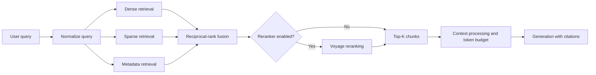

The dense, sparse, and metadata branches run concurrently in [`RetrievalService.search_hybrid()`](../../apps/api/app/ai/knowledge/retrieval/service.py). The current retrieval strategy enum has dense, sparse, metadata, hybrid, parent-child, and query-decomposition strategies, but no graph strategy.

### Checked-in benchmark baseline

| Current candidate | Average latency | p95 latency | Recall@5 | MRR | nDCG@5 |
|---|---:|---:|---:|---:|---:|
| Hybrid without reranking | 381.36 ms | 547.83 ms | 1.000 | 0.925 | 0.9446 |
| Hybrid + local cross-encoder | 625.37 ms | 1,100.08 ms | 1.000 | 1.000 | 1.000 |
| Hybrid + Voyage reranking | 753.86 ms | 922.90 ms | 1.000 | 0.950 | 0.9631 |

Source: [`benchmarks/reports/reranking/report.md`](../../benchmarks/reports/reranking/report.md).

These results should not be used to claim that GraphRAG cannot improve the system:

- The dataset contains only five research documents and twenty queries.
- Relevance is judged at document level rather than relationship/evidence-path level.
- Recall@5 is already 1.0 for every candidate, leaving no room for measured recall improvement.
- The dataset does not contain a dedicated relational, multi-hop, or global-sensemaking slice.

It also means that no honest platform-specific GraphRAG improvement percentage can be given before a suitable benchmark is created.

## 4. What “adding GraphRAG” should mean here

GraphRAG can refer to several materially different capabilities.

| Capability | Purpose | Recommended phase |
|---|---|---|
| Entity index | Resolve people, organizations, methods, datasets, concepts, and other domain entities to source chunks. | Phase 1 |
| Relationship graph | Store typed, directed relationships with confidence and source-chunk provenance. | Phase 1 |
| Local graph traversal | Answer questions about a named entity and its one-hop or two-hop relationships. | Phase 1 |
| Graph + text fusion | Return graph-supported source chunks through the existing fusion/reranking/context pipeline. | Phase 1 |
| Claims and temporal validity | Represent claims, dates, contradictions, and versioned relationships. | Phase 2, if required |
| Community detection | Group densely connected entities into topics or themes. | Phase 2 |
| Community summaries | Precompute summaries for corpus-level questions. | Phase 2 |
| Global map-reduce search | Answer broad questions across community summaries. | Phase 2, Deep Research only |
| DRIFT or iterative graph search | Move between global and local evidence dynamically. | Later, only after evaluation |

Microsoft's reference implementation similarly distinguishes local entity-oriented search from global community-report search. Its standard index extracts entities and relationships, detects communities, and generates community reports; it also warns that indexing can be expensive. The official documentation describes a faster NLP/co-occurrence alternative and estimates graph extraction at roughly 75% of standard indexing cost:

- [Microsoft GraphRAG indexing methods](https://github.com/microsoft/graphrag/blob/main/docs/index/methods.md)
- [Microsoft GraphRAG indexing architecture](https://github.com/microsoft/graphrag/blob/main/docs/index/architecture.md)
- [Microsoft GraphRAG query methods](https://github.com/microsoft/graphrag/blob/main/docs/query/overview.md)

## 5. Recommended architecture

### 5.1 Core design decision

Add GraphRAG as a **sidecar knowledge representation and optional retrieval branch**.

Do not:

- replace Qdrant;
- change the default hybrid strategy;
- make graph construction a prerequisite for document indexing success;
- return graph facts without source-chunk evidence;
- add an LLM call to every query merely to decide whether graph retrieval is needed.

### 5.2 Proposed component model

| Component | Responsibility | Reuse of current platform |
|---|---|---|
| `GraphExtractionService` | Extract entities and relationships from processed chunks. | Reuse canonical processed documents, chunk IDs, model routing, usage/cost tracking, artifacts, and async workers. |
| `EntityResolver` | Normalize aliases and merge references to the same entity inside an owner boundary. | Reuse embeddings where useful; preserve `owner_id` isolation. |
| `GraphRepository` | Persist entities, relationships, evidence links, confidence, versions, and graph-index status. | Start with PostgreSQL to avoid a new service. |
| `GraphIndexingWorker` | Build/update the graph asynchronously after normal indexing succeeds. | Reuse queue/retry/dead-letter patterns. |
| `GraphQueryRouter` | Decide `OFF`, `LOCAL_GRAPH`, `GLOBAL_GRAPH`, or `HYBRID_ONLY`. | Integrate after query normalization; use deterministic rules first. |
| `GraphRetrievalService` | Resolve query entities, traverse bounded paths, score paths, and return evidence-linked candidates. | Implement behind the retrieval service boundary. |
| `GraphEvidenceAdapter` | Convert graph paths into existing `RetrievedChunk`-compatible evidence with graph metadata. | Allows reuse of fusion, reranking, context processing, citations, validation, and generation. |
| `GraphRetrievalBenchmark` | Compare current hybrid retrieval against graph-augmented retrieval on graph-oriented queries. | Reuse benchmark report, regression, provenance, and threshold infrastructure. |

### 5.3 Minimum graph data model

| Table / object | Required fields | Purpose |
|---|---|---|
| `graph_entities` | `entity_id`, `owner_id`, canonical name, entity type, description, embedding, confidence, version | Canonical entity nodes |
| `graph_entity_aliases` | `entity_id`, alias, normalized alias | Entity linking and query resolution |
| `graph_relationships` | `relationship_id`, `owner_id`, source entity, target entity, type, description, confidence, valid time, version | Typed graph edges |
| `graph_evidence` | relationship/entity ID, `document_id`, `chunk_id`, extraction span, extraction method | Makes every graph result traceable to original evidence |
| `graph_communities` | community ID, level, members, algorithm/version | Later global GraphRAG support |
| `graph_community_reports` | community ID, summary, source chunk IDs, generation metadata | Later corpus-level retrieval |
| `document_graph_status` | document ID, state, graph version, extraction version, error, timestamps | Keeps graph readiness independent from normal index readiness |

All graph records must include `owner_id`. Tenant filtering must happen inside every entity lookup and traversal, not after results are returned.

## 6. Ingestion and graph construction flow

### 6.1 Non-breaking asynchronous flow

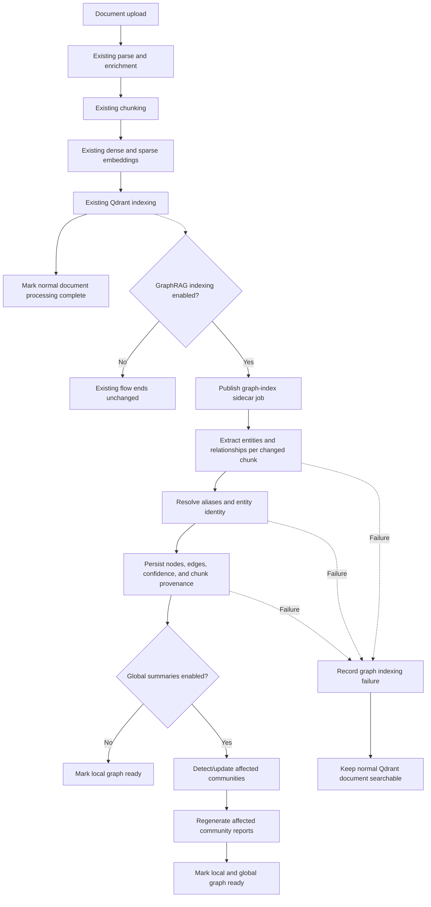

### 6.2 Why the graph job must be a sidecar

- Normal document availability must not depend on probabilistic relationship extraction.
- Graph extraction may require retries, model calls, or slower batch processing.
- A document can be available immediately through current RAG while its graph projection is still building.
- Graph indexing can be backfilled gradually.
- Disabling GraphRAG must not require reprocessing the current vector index.
- Failed graph extraction can degrade to hybrid retrieval rather than fail the upload.

### 6.3 Incremental updates

| Event | Required behavior |
|---|---|
| New document | Extract only new chunks, then resolve against the owner's existing entities. |
| Reprocessed document | Version graph output; replace edges whose provenance belongs only to superseded chunks. |
| Deleted document | Remove its evidence links; delete an entity/edge only when no other valid evidence supports it. |
| Extraction-model change | Build a new graph version in parallel and switch only after validation. |
| Entity merge/split | Preserve an audit record so citations and past evaluation runs remain reproducible. |

## 7. Query-time flow

### 7.1 Optional graph-augmented retrieval

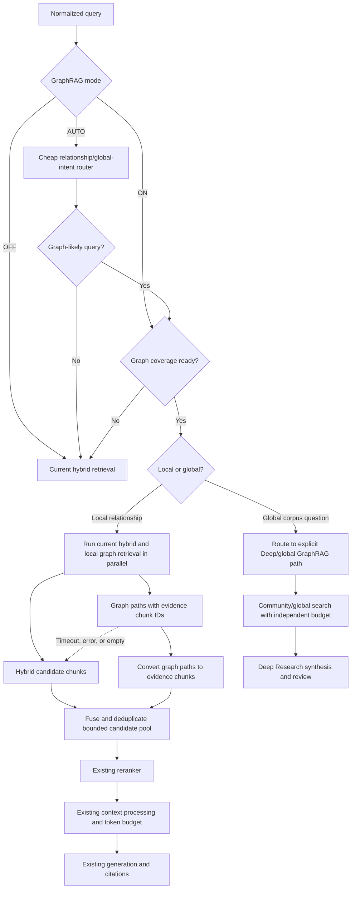

### 7.2 Local graph retrieval steps

1. Normalize the query using the current query boundary.
2. Detect entity mentions with aliases, embeddings, or lightweight NER.
3. Resolve mentions within the authenticated owner's graph.
4. Traverse only bounded relationship types and depth.
5. Score paths using:

   - entity match;
   - relationship confidence;
   - path length penalty;
   - evidence freshness;
   - source trust;
   - query/relationship semantic similarity.

6. Map every path back to supporting chunk IDs.
7. Return source chunks with graph metadata such as:

   - path entities;
   - relationship types;
   - traversal score;
   - graph version;
   - supporting edge IDs.

8. Fuse with current hybrid results.
9. Apply the existing reranker, context token budget, citation handling, generation, and validation.

### 7.3 Global GraphRAG flow

Global GraphRAG should not be placed on the synchronous Chat or Linear path by default.

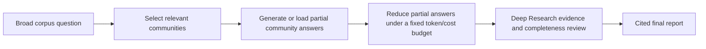

It belongs behind:

- Deep Research;
- explicit user selection;
- an asynchronous job;
- a separate latency/cost budget;
- a hard cap on communities and map/reduce calls.

The original GraphRAG paper reports substantial gains in comprehensiveness and diversity for global sensemaking questions over very large corpora, not universal gains for every factual lookup: [From Local to Global: A Graph RAG Approach to Query-Focused Summarization](https://arxiv.org/abs/2404.16130).

## 8. Feature switching and failure isolation

### 8.1 Proposed control hierarchy

| Control | Values | Purpose |
|---|---|---|
| Deployment flag | `disabled`, `shadow`, `enabled` | Safe rollout and immediate kill switch |
| Tenant capability | allowed / denied | Controls graph indexing and retrieval per tenant |
| Request mode | `off`, `auto`, `local`, `global` | Allows callers to force or avoid the path |
| Corpus readiness | unavailable, partial, ready, stale, failed | Prevents routing to incomplete graph coverage |
| Global-search capability | enabled / disabled | Keeps expensive global map/reduce independent from local traversal |
| Query timeout | e.g. 100–150 ms local graph budget | Prevents graph traversal from controlling request latency |
| Candidate cap | fixed graph candidates and paths | Bounds fusion, reranking tokens, and context size |

### 8.2 Required invariants

- `off` must call the current `search_hybrid()` implementation directly.
- `auto` must default to hybrid retrieval when classification confidence is low.
- A graph error must never fail a request that current hybrid retrieval can answer.
- Graph candidates must not bypass owner filtering, trust checks, context sanitization, reranking, or citation validation.
- Graph traversal must never create uncited facts; it returns evidence-linked chunks, not free-standing assertions.
- The existing final `top_k` and context token budget must remain unchanged unless explicitly configured.
- Shadow mode may execute graph retrieval for measurement, but its results must not affect the user response.

### 8.3 Suggested retrieval API evolution

| Existing concept | Proposed addition |
|---|---|
| `RetrievalStrategy.HYBRID` | Add `GRAPH_LOCAL` and `GRAPH_AUGMENTED`; keep `HYBRID` default. |
| `RetrievalQuery` | Add optional `graph_mode`, `max_hops`, and allowed relationship filters through a backward-compatible options object. |
| `RetrievalStatistics` | Add graph route, graph latency, entity matches, paths considered, paths returned, graph version, and fallback reason. |
| `RetrievalResult` | Continue returning canonical chunks; attach graph path metadata to supporting chunks. |
| Retrieval factory | Inject an optional `GraphRetrievalService`; `None` means the current behavior. |

## 9. How GraphRAG may improve retrieval quality

### 9.1 Expected effect by query type

| Query type | Current hybrid RAG | Potential GraphRAG contribution | Expected improvement |
|---|---|---|---|
| Direct fact in one chunk | Already strong | Little additional information | **None to low** |
| Exact term, acronym, code, or title | Sparse retrieval already strong | Entity aliases may help | **Low** |
| Semantic topic question | Dense + sparse usually sufficient | Connected concepts may add supporting context | **Low to moderate** |
| “How is A related to B?” | May retrieve A and B separately without the connecting evidence | Traverses and returns the relationship path | **High potential** |
| Multi-hop question across documents | Deep Research can decompose and retrieve independently | Graph path provides explicit intermediate entities and evidence | **Moderate to high potential** |
| Cross-document entity history | May return several unconnected passages | Consolidated entity node and versioned edges improve completeness | **Moderate to high potential** |
| Broad corpus themes | Top-K vector retrieval samples only a small portion of the corpus | Community reports cover the corpus structure | **High potential**, but expensive |
| Fresh/current question | Graph may be stale | Existing web fallback is more appropriate | **Graph may hurt unless freshness is enforced** |
| Subjective or creative question | Retrieval architecture is not the main constraint | Little value | **None** |

### 9.2 Quality dimensions

| Dimension | Improvement mechanism | Risk |
|---|---|---|
| Recall | A graph can reach supporting chunks that do not independently resemble the raw query. | Bad entity resolution can retrieve unrelated neighborhoods. |
| Precision | Relationship and type constraints can narrow candidate evidence. | Noisy LLM-extracted edges can reduce precision. |
| Ranking | Path confidence and graph proximity add signals beyond embedding similarity. | Graph scores are not naturally calibrated with vector and sparse scores. |
| Answer completeness | Connected evidence can expose intermediate facts and multiple supporting documents. | Excessive traversal creates noisy context and “graph sprawl.” |
| Explainability | The system can show the path and supporting chunks used. | A visually plausible path may still represent an incorrectly extracted relationship. |
| Global coverage | Community summaries can represent themes not discoverable through a single top-K search. | Summaries introduce another generated artifact that can omit or distort source evidence. |

## 10. Added complexity

| Complexity area | Added work | Level |
|---|---|---|
| Data modeling | Entity types, aliases, typed edges, claims, temporal validity, confidence, evidence, and graph versions | **High** |
| Ingestion | Extraction, entity resolution, deduplication, incremental updates, deletion, retries, and backfills | **High** |
| Storage | Graph tables/indexes initially; potentially a new graph database later | **Medium initially; high with new infrastructure** |
| Retrieval | Entity resolution, traversal, path scoring, graph/text fusion, timeouts, and fallback | **High** |
| Evaluation | Graph-specific golden set with answer-bearing paths and multi-hop evidence | **High and mandatory** |
| Security | Tenant isolation must apply to every node, edge, alias, and traversal | **High** |
| Provenance | Every entity and edge must map to source chunks and graph/extraction versions | **High** |
| Operations | Graph build status, lag, failed extraction, stale graph, storage growth, and traversal metrics | **Medium–high** |
| Product UX | Mode selection, graph availability, progress, limitations, and optional path explanations | **Medium** |
| Team expertise | Knowledge representation, entity resolution, graph query tuning, and quality evaluation | **Medium–high** |

### 10.1 Main new failure modes

- Incorrect entity merges, such as two people with the same name.
- Duplicate entities caused by unresolved aliases.
- Hallucinated or inverted relationships from extraction.
- Stale edges after document replacement or deletion.
- Cross-tenant graph traversal if owner constraints are omitted.
- High-degree “hub” entities producing large, irrelevant neighborhoods.
- Cyclic or unbounded traversal.
- Graph evidence that cannot be mapped back to a source chunk.
- Global community summaries that are stale or insufficiently grounded.
- Disagreement between graph facts and newly retrieved text.

## 11. Latency analysis

### 11.1 Request latency by mode

The following values are engineering planning ranges, not measured ResearchMind results.

| Mode | Extra query-time work | Estimated incremental latency | User-facing effect |
|---|---|---:|---|
| Graph disabled | None | **0 ms** | Current behavior |
| Shadow mode | Parallel graph branch, result ignored | **0 ms on response path** if fully detached; extra background compute | No answer effect |
| Auto route, non-graph query | Deterministic/heuristic routing | **<1–5 ms** | Negligible |
| Auto route with local graph, cached entities | Indexed lookup + one/two-hop traversal + evidence fetch | **~15–100 ms branch time** | Often hidden by the current 381–754 ms retrieval/rerank path when run in parallel |
| Local graph with embedding entity resolution | Reused or additional query embedding + traversal | **~30–150 ms branch time** | Small if parallel and bounded |
| LLM query-to-graph translation | Additional model call before traversal | **~300–1,500+ ms** | Not recommended on normal path |
| Global community search | Multiple map calls plus reduce/synthesis | **Seconds to tens of seconds** | Deep Research/async only |

### 11.2 Parallel latency behavior

For local graph augmentation:

```text
serial latency   = hybrid + graph + merge + rerank
parallel latency = max(hybrid, graph) + merge + rerank
```

If:

- current hybrid branch = 381 ms;
- graph branch = 80 ms;
- merge = 5 ms;

then the parallel pre-rerank time is approximately `max(381, 80) + 5 = 386 ms`, not `466 ms`.

This is only achieved when:

- graph routing does not require a slow preceding LLM call;
- graph and hybrid retrieval start together;
- traversal has a strict timeout;
- graph result count is capped;
- the reranker receives a bounded total pool rather than current candidates plus an unlimited graph neighborhood.

### 11.3 Latency controls

- Use deterministic intent rules and entity dictionaries before considering an LLM router.
- Reuse the current query embedding for entity resolution.
- Restrict local traversal to one or two hops.
- Filter relationship types before traversal.
- Index `owner_id`, normalized alias, source entity, target entity, and relationship type.
- Cache resolved entities and common graph paths.
- Execute graph and current hybrid retrieval concurrently.
- Set a short graph timeout and use current hybrid results on timeout.
- Cap graph paths and evidence chunks before fusion.
- Keep community/global search off the synchronous path.
- Build and refresh the graph asynchronously.

## 12. Cost analysis

### 12.1 Cost categories

| Cost category | Fast/local graph approach | Standard LLM GraphRAG approach |
|---|---|---|
| Entity extraction | Local NLP/NER compute | LLM input/output tokens per chunk |
| Relationship extraction | Co-occurrence, dependency parsing, or compact local model | LLM input/output tokens per chunk, possibly multiple passes |
| Entity resolution | Embedding/local compute and database operations | Embeddings plus optional LLM disambiguation |
| Community detection | Local graph compute | Local graph compute |
| Community reports | Optional | LLM generation for each community/level |
| Query-time local traversal | Database compute; normally no direct model charge | Same unless an LLM query planner is added |
| Query-time global search | Not required | Multiple map calls plus reduce/final generation |
| Storage | Nodes, edges, aliases, evidence, indexes | Same plus descriptions, claims, community reports, caches |
| Operations | Worker capacity, monitoring, backup, graph maintenance | Same, usually at higher indexing volume |

### 12.2 Cost formulas

For an LLM-based graph build:

```text
graph_index_cost
  = extraction_input_tokens × input_token_price
  + extraction_output_tokens × output_token_price
  + entity/relationship_summary_tokens
  + community_report_tokens
  + embedding_cost
  + graph storage/compute
```

For global search:

```text
global_query_cost
  = selected_communities × map_call_cost
  + reduce_call_cost
  + final_validation/review cost
```

The system should calculate these from actual provider usage rather than hard-code a dollar estimate, because cost depends on:

- corpus tokens;
- chunk size;
- extraction prompt and gleaning passes;
- entity density;
- selected model;
- output verbosity;
- number and levels of communities;
- incremental update frequency;
- provider pricing at execution time.

### 12.3 Planning-level cost impact

| Design | Offline/indexing cost | Online cost | Recommendation |
|---|---|---|---|
| NLP entities + co-occurrence edges, no summaries | Low additional compute and storage | Near-zero direct API cost | Cheapest experiment; graph quality may be noisy |
| Compact-model entity/relationship extraction | Moderate | Near-zero local-query direct API cost | Recommended MVP if extraction quality is acceptable |
| Frontier-model extraction and summaries | High; can dominate indexing cost | Local query still low; global query higher | Use only for corpora where measured quality justifies it |
| Global map-reduce for every query | High | High and variable | Do not do this |
| Routed global search in Deep Research | High only for selected queries | Bounded and user-visible | Appropriate later phase |

### 12.4 Storage planning range

Without platform measurements, storage must be estimated from observed extraction density:

```text
graph storage
  ≈ entities
  + aliases
  + relationships
  + evidence links
  + graph indexes
  + optional descriptions/claims/community reports
```

A reasonable capacity-planning placeholder is **an additional 20%–100% of current structured index metadata**, excluding duplicated raw text and embeddings. This is not a commitment: a description-heavy graph or many evidence links can exceed that range, while a lightweight co-occurrence graph can be smaller.

## 13. Expected performance improvement versus cost and latency

### 13.1 What can and cannot be claimed now

| Claim | Can it be made now? | Reason |
|---|---|---|
| GraphRAG will improve all ResearchMind queries | **No** | It targets relational and global retrieval failure modes, not every query. |
| GraphRAG will improve the current 20-query benchmark | **Unknown** | The benchmark is saturated and has no graph-path labels. |
| GraphRAG can improve relationship and global-sensemaking answers | **Supported directionally** | Graph traversal and community summaries address information not well represented by independent top-K similarity. |
| Exact ResearchMind accuracy/completeness gain | **No, not before implementation and A/B evaluation** | It depends on corpus, extraction quality, query mix, routing precision, and graph freshness. |
| Disabled-path latency can remain unchanged | **Yes, architecturally** | The proposed switch calls the existing flow directly when off. |

### 13.2 Hypothesis ranges for experiment planning

These ranges are test hypotheses, not promised results.

| Query slice | Accuracy / task-success lift hypothesis | Answer-completeness lift hypothesis | Incremental local latency target | Cost profile |
|---|---:|---:|---:|---|
| Simple factual | **0–3 percentage points** | **0–3 pp** | 0 ms when not routed | None |
| Entity relationship | **8–25 pp** | **10–30 pp** | 0–150 ms branch time | Low online; indexing cost |
| Multi-document multi-hop | **5–20 pp** | **8–25 pp** | 0–150 ms local, or more if iterative | Low–moderate online |
| Broad corpus/global themes | **5–20 pp** | **10–30 pp** | Seconds; asynchronous | High query and indexing cost |
| Whole traffic mix | Depends on routed share | Depends on routed share | Near zero for bypassed traffic | Dominated by offline indexing |

### 13.3 Blended improvement model

The expected whole-platform lift is approximately:

```text
overall lift
  = share of graph-suitable queries
  × route precision
  × quality lift on correctly routed graph queries
  - harm from incorrectly routed/noisy graph queries
```

Illustrative example:

- 20% of queries are truly graph-suitable;
- the router identifies 80% of them correctly;
- those queries gain 20 percentage points;
- incorrectly routed queries cause no measurable harm because hybrid evidence remains and graph candidates are reranked.

Then the approximate aggregate lift is:

```text
0.20 × 0.80 × 0.20 = 0.032
```

That is a **3.2 percentage-point aggregate improvement**, despite a 20-point lift on the target slice. This is why GraphRAG must be evaluated by query slice as well as by overall average.

### 13.4 Decision matrix

| Measured outcome | Decision |
|---|---|
| Relational quality lift ≥10 pp, blended lift ≥3 pp, local p95 overhead ≤150 ms | Promote `auto` for the validated query slice |
| Relational lift is material but p95 overhead is too high | Keep explicit/Deep mode; optimize traversal and routing |
| Global completeness improves materially but cost is high | Keep global GraphRAG as an explicit asynchronous Deep Research option |
| Lift occurs only on a very small query share | Keep `off` by default and expose an opt-in feature |
| No material lift over hybrid + reranking + decomposition | Do not add production GraphRAG; retain the experiment only |
| Graph extraction precision is poor | Improve schema/entity resolution before evaluating answer quality |

## 14. Required evaluation plan

### 14.1 New benchmark slices

| Slice | Example | Required ground truth |
|---|---|---|
| Single-hop relationship | “Which organization developed method X?” | Expected edge and evidence chunk |
| Two-hop relationship | “How is researcher A connected to dataset B?” | Expected entity path and evidence per hop |
| Cross-document comparison | “Which methods use the same benchmark and how do results differ?” | Expected entities, relations, documents, and answer |
| Temporal relationship | “How did the conclusion about X change across versions?” | Time/version-qualified edges and sources |
| Global themes | “What are the major themes and how are they connected?” | Human-reviewed topic coverage and relationship set |
| Negative/no-path | “Is A related to B?” when the corpus does not establish it | Expected no-answer/insufficient-evidence behavior |
| Alias resolution | Acronyms, full names, alternate spellings | Canonical entity and supporting chunks |
| High-degree hub | Common concepts connected to many papers | Relevant constrained neighborhood |

### 14.2 Candidate comparison

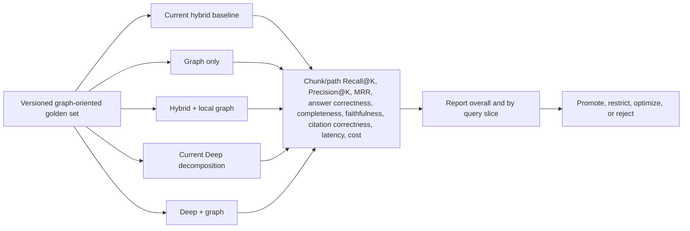

### 14.3 Metrics

- Retrieval:

  - evidence-chunk Recall@K;
  - evidence-chunk Precision@K;
  - path recall;
  - path precision;
  - MRR/nDCG;
  - entity-resolution accuracy;
  - relationship extraction precision/recall;
  - no-path accuracy.

- Generation:

  - answer correctness;
  - completeness;
  - faithfulness;
  - claim-level citation correctness;
  - unsupported relationship rate.

- Operational:

  - route-selection precision/recall;
  - graph coverage/readiness;
  - graph fallback rate;
  - graph p50/p95/p99 latency;
  - extraction tokens/cost per document;
  - incremental graph update lag;
  - graph storage per indexed token;
  - global search calls/tokens/cost.

## 15. Pros and cons

| Pros | Cons |
|---|---|
| Retrieves explicit relationships rather than relying only on text similarity. | Adds a second knowledge representation that must stay synchronized with source documents. |
| Can improve multi-hop and cross-document completeness. | Entity and relationship extraction can hallucinate or misclassify facts. |
| Can surface evidence that is not semantically similar to the raw question. | Entity resolution and alias handling are difficult and domain-specific. |
| Provides explainable entity paths linked to source chunks. | A plausible graph path can create false confidence if provenance or confidence is weak. |
| Supports corpus-level themes through community summaries. | Community generation and global map-reduce can be expensive and slow. |
| Complements current hybrid retrieval rather than duplicating sparse/dense search. | Simple factual traffic may receive little or no quality benefit. |
| Can improve graph-oriented Deep Research planning and gap discovery. | Requires new benchmarks, observability, operational runbooks, and maintenance processes. |
| Optional routing limits its cost to suitable questions. | A router introduces false-positive and false-negative decisions. |
| Offline graph build keeps most local-query cost low. | Indexing cost and document-to-graph freshness become product concerns. |
| PostgreSQL MVP avoids immediate new infrastructure. | At larger graph scale, recursive SQL may become a bottleneck and require migration. |

## 16. Value of GraphRAG in a research application

### 16.1 Why the research context changes the value proposition

Research questions frequently ask about connections, evolution, agreement, disagreement, influence, and coverage across many papers rather than asking for one passage that resembles the query. This makes relationship-aware retrieval more relevant to ResearchMind than it would be to a simple documentation assistant.

The present platform already covers a large part of the research workflow:

- hybrid dense, sparse, and metadata retrieval finds semantically similar and exact-term evidence;
- reranking improves the order of retrieved chunks;
- query decomposition breaks a complex goal into smaller research tasks;
- Deep Research executes bounded task waves;
- evidence aggregation, synthesis, review, citation validation, and gap research improve report completeness;
- web search can fill a local knowledge gap after approval.

GraphRAG should therefore not be described as making currently impossible research generally possible. Its distinctive value is narrower: it can make **relationships between evidence first-class, queryable, and reusable**, rather than requiring every research run to rediscover those relationships from independent text chunks.

| Research requirement | Current implementation | GraphRAG contribution | Incremental value |
|---|---|---|---|
| Find papers about a topic | Hybrid retrieval and reranking are well suited | Entity/topic neighborhood may add related papers | Low for direct topical search |
| Answer a question contained in one paper | Current chunk retrieval is sufficient | Little additional value | Low |
| Decompose a complex research question | Deep Research planner already does this | Graph schema can inform decomposition and dependency ordering | Moderate |
| Connect evidence across papers | Separate tasks can retrieve each paper and synthesis can infer the connection | Stores an explicit evidence path across papers, methods, datasets, authors, and findings | High when relationships matter |
| Trace how a claim evolved over time | Possible through date-filtered searches and synthesis, but no persistent claim lineage | Traverses `SUPPORTS`, `CONTRADICTS`, `EXTENDS`, and `PUBLISHED_AFTER` relationships | High |
| Identify research communities or corpus-wide themes | Broad retrieval and multi-wave synthesis can approximate this, with high context/call cost | Community detection and summaries provide a reusable global view | High for large corpora |
| Explain why two papers are related | Semantic similarity can return both but does not explain the relationship | Returns the connecting entities and source-backed edges | High |
| Detect evidence gaps | Reviewer can ask one targeted follow-up question | Graph coverage can expose missing datasets, populations, methods, replications, or disconnected claims | Moderate to high |
| Preserve citation traceability | Existing evidence IDs and citations already provide strong provenance | Adds provenance for every node and edge back to source chunks | Moderate, provided provenance is enforced |

### 16.2 Research use cases that current retrieval cannot reliably resolve

“Cannot resolve” below means that the current architecture has no deterministic relationship representation for the question. Deep Research may still produce an answer by retrieving several texts and asking the LLM to infer the connection, but the result is less reliable, repeatable, and inspectable.

| Use case | Example question | Why current retrieval is insufficient or fragile | GraphRAG path |
|---|---|---|---|
| Citation and influence chain | “Which later methods descend from Paper A’s training objective, and through which intermediate papers?” | Similarity search returns papers discussing similar objectives but does not store derivation or citation paths. Query decomposition still has to infer every hop from prose. | `Paper A <-[:CITES|EXTENDS]- Paper B <-[:CITES|EXTENDS]- Paper C`, with each edge linked to evidence |
| Contradiction map | “Which studies contradict the claimed effect of intervention X, and do they use different populations or measurements?” | Current retrieval can find “intervention X” and “contradiction” separately, but cannot reliably join claim polarity, population, and measurement across studies. | `Claim <-[:SUPPORTS|CONTRADICTS]- Finding -[:OBSERVED_IN]-> Population` and `Finding -[:USES_MEASURE]-> Measure` |
| Dataset leakage or benchmark lineage | “Do these supposedly independent results reuse data derived from the same original dataset?” | Dataset aliases and derivation relationships may not be lexically similar; independent task retrieval may treat renamed derivatives as unrelated. | `Study -[:USES]-> Dataset -[:DERIVED_FROM*1..N]-> OriginalDataset` |
| Method–dataset–outcome comparison | “Across transformer pruning studies using Dataset D, which techniques improve latency without reducing accuracy?” | Hybrid retrieval finds relevant studies, but constructing the three-way join and comparison repeatedly depends on LLM extraction during each run. | Traverse `Study -> Method`, `Study -> Dataset`, and `Study -> MetricResult`, then retrieve supporting chunks |
| Author/institution collaboration network | “Which research groups connect causal inference and medical imaging, and through which collaborators?” | Topical chunks can identify authors but do not provide a reliable multi-hop collaboration path. | `Researcher -[:AFFILIATED_WITH]-> Institution` and `Researcher -[:COAUTHORED]-> Paper -[:ABOUT]-> Topic` |
| Claim lineage and semantic drift | “How has the definition of ‘alignment’ changed from early papers to recent evaluations?” | Date filters plus synthesis can summarize documents, but the system does not persist versions of a concept or link claims that refine or redefine it. | `Claim -[:REFINES|REDEFINES|DISPUTES]-> Claim`, ordered by publication date |
| Systematic-review coverage check | “Which combinations of population, intervention, comparator, and outcome have no supporting study in this corpus?” | Retrieval only returns what exists. It cannot naturally answer a negative coverage query over combinations without a structured model. | Query missing PICO-pattern relationships and report absent cells, subject to corpus-completeness caveats |
| Cross-session reusable research map | “Continue the earlier literature review from the unresolved replication gap.” | Research memory preserves conversation/history, but not a normalized, queryable map of accumulated claims and relationships. | Persist reviewed research entities, findings, and unresolved gaps as owner-scoped graph objects |

Important boundaries:

- GraphRAG cannot establish that a scientific claim is true merely because many graph edges support it.
- Missing graph edges may mean failed extraction or missing source coverage, not a real absence in the literature.
- Automatically inferred `SUPPORTS`, `CONTRADICTS`, or `EXTENDS` edges need confidence, provenance, and preferably review for high-stakes research.
- Citation graphs alone are not enough; the useful research graph must distinguish bibliographic links from evidence-bearing semantic relationships.

### 16.3 Recommended research ontology

The initial ontology should be deliberately small and evidence-oriented.

| Node | Important properties | Principal relationships |
|---|---|---|
| `Paper` | paper ID, DOI, title, year, venue, owner/corpus ID | `CITES`, `AUTHORED_BY`, `ABOUT`, `USES`, `REPORTS` |
| `Chunk` | canonical Qdrant chunk ID, document ID, page/section, text hash | `PART_OF`, `MENTIONS`, `EVIDENCES` |
| `Researcher` | canonical ID, name, ORCID where available | `AUTHORED`, `AFFILIATED_WITH`, `COLLABORATED_WITH` |
| `Institution` | canonical ID, name, region | `AFFILIATED_RESEARCHER` |
| `Concept` | canonical label, aliases, definition version | `RELATED_TO`, `BROADER_THAN`, `REFINES` |
| `Method` | canonical label, aliases, method family | `USED_BY`, `EXTENDS` |
| `Dataset` | canonical name, aliases, version, license | `USED_BY`, `DERIVED_FROM` |
| `Claim` | normalized statement, polarity, confidence | `SUPPORTED_BY`, `CONTRADICTED_BY`, `REFINES`, `EVIDENCED_BY` |
| `Finding` | outcome, direction, effect/value, uncertainty | `REPORTS_ON`, `OBSERVED_IN`, `USES_MEASURE`, `EVIDENCED_BY` |
| `ResearchGap` | description, status, source run | `ABOUT`, `REQUIRES_EVIDENCE`, `RESOLVED_BY` |

Every semantic node and relationship must carry:

- `owner_id` or corpus visibility scope;
- source document and chunk identifiers;
- extraction model and prompt version;
- extraction timestamp;
- confidence and review status;
- document version or content hash;
- deletion/tombstone state.

### 16.4 Where GraphRAG adds the most product value

| Product surface | Recommended behavior |
|---|---|
| Linear Research | Keep graph mode off by default. Offer explicit local graph augmentation for relationship questions only. |
| Deep Research planning | Use graph schema and neighborhoods to propose better subquestions, but do not let graph results bypass the normal evidence contract. |
| Deep Research retrieval | Execute Neo4j local retrieval alongside the existing task retriever for graph-eligible tasks. |
| Evidence aggregation | Convert graph paths into ordinary `ResearchEvidenceReference` records with source chunk citations. |
| Gap review | Compare planned concepts/relationships with retrieved graph coverage to formulate a bounded follow-up task. |
| Related papers | Use citation, author, method, dataset, and concept neighborhoods in addition to embedding similarity. |
| Research workspace | Later, visualize evidence paths and allow users to accept, reject, or correct extracted relationships. |

### 16.5 Where GraphRAG does not add much value over the current implementation

GraphRAG is not a general upgrade to every research query. For the following use cases, the existing hybrid retrieval, reranking, metadata filters, query decomposition, Deep Research, memory, and evidence-review pipeline already provide most of the required value.

| Research use case | Why the current implementation is already suitable | Likely GraphRAG value | Possible GraphRAG disadvantage | Recommendation |
|---|---|---|---|---|
| Direct factual question from one paper | Hybrid retrieval can locate the relevant passage and the current citation pipeline can ground the answer | Very low | Extra route/traversal work without better evidence | Keep current retrieval |
| Known-paper lookup | Sparse search and metadata are better suited to exact title, DOI, author, or identifier lookup | None to very low | Entity resolution may introduce another failure mode | Keep sparse/metadata path |
| General topical literature discovery | Dense retrieval finds semantically related papers; reranking improves ordering | Low unless relationship explanations are required | Graph neighbors can overemphasize highly connected or older papers | Use current hybrid search first |
| Summarize one document | The source is already known, so retrieval and bounded context construction are sufficient | None | Graph construction is wasted work | Do not route to graph |
| Compare two or three explicitly named papers | Query decomposition can retrieve each paper and Deep Research can synthesize a cited comparison | Low to moderate | Pre-extracted graph properties may omit nuances present in full text | Use Deep Research; add graph only when repeated structured comparisons justify it |
| Ordinary multi-part research question | Current planner creates tasks, executes waves, aggregates evidence, reviews coverage, and performs gap research | Low when subquestions are independent | A graph branch duplicates retrieval and increases operational complexity | Use the existing Deep Research workflow |
| Recent events or newly published material | Approved web search is more likely to contain the latest evidence than an asynchronously built graph | Low until graph indexing catches up | Stale nodes and edges can create misleading confidence | Prefer web/current-source retrieval |
| Broad prose explanation | Generation quality depends mainly on good evidence and synthesis, which the current pipeline already handles | Low | Community summaries may flatten important qualifications | Use existing synthesis and review |
| Citation formatting and source attribution | Existing evidence IDs, citation validation, and report artifacts already address this | Low | Graph provenance duplicates rather than replaces citation controls | Preserve the current evidence contract |
| Conversational continuity | Research conversation history and memory address prior-turn context | None for ordinary memory | A knowledge graph is not a replacement for conversational or episodic memory | Keep memory architecture separate |
| Exact numerical extraction from tables | A structured parser, table extraction, SQL/analytical store, or exact chunk retrieval is more reliable | Low | LLM-created graph values may lose units, confidence intervals, or table context | Improve structured extraction instead |
| Small personal corpus | Current retrieval has little search-space or completeness pressure | Very low | Fixed Neo4j and extraction overhead may exceed any quality benefit | Do not enable by default |
| Corpus with few stable relationships | Vector and keyword relevance carry most of the useful signal | Very low | Sparse or noisy graph produces weak paths and false confidence | Do not build a semantic graph |
| Questions answered by one-hop metadata filters | Existing metadata retrieval can constrain author, date, document type, or owner directly | None to low | A graph query adds latency to a simpler indexed filter | Keep metadata retrieval |

GraphRAG also adds little value when:

- the corpus is too small to form meaningful relationship structures;
- documents change faster than the graph can be updated;
- entity and relationship extraction accuracy is below the level required by the research domain;
- users mainly ask independent single-hop questions;
- the product does not expose relationship exploration, systematic-review workflows, or cross-paper analysis;
- the team cannot maintain provenance, deletion propagation, tenant isolation, and graph-specific evaluation;
- no graph-oriented benchmark shows failures in the existing implementation.

In these cases, improving the current system is likely to provide a better return:

- tune hybrid fusion and reranking;
- add stronger metadata extraction and filtering;
- improve parent-document retrieval and context construction;
- expand the research benchmark;
- improve table and structured-data extraction;
- strengthen Deep Research planning, evidence grading, and gap review;
- improve ingestion freshness and source coverage.

### 16.6 Recommendation score for adding GraphRAG

#### Overall rating

| Decision | Rating | Interpretation |
|---|---:|---|
| Add a **scoped, optional local GraphRAG experiment** | **7.5/10** | Recommended, provided it is benchmark-first, feature-flagged, provenance-backed, and limited to relationship/multi-hop research |
| Add GraphRAG to the platform **at the current stage overall** | **6.5/10** | Conditional recommendation rather than an immediate platform-wide priority |
| Add **full global/community GraphRAG now** | **4/10** | Not recommended until corpus size, query demand, and measured global-completeness gains justify indexing and operational cost |
| Replace current hybrid retrieval with GraphRAG | **1/10** | Strongly not recommended |

The primary recommendation is therefore **6.5/10: build a narrow experiment, not a wholesale migration**.

#### Weighted assessment

In this table, a higher score is more favorable to adoption.

| Criterion | Weight | Score | Weighted contribution | Reason |
|---|---:|---:|---:|---|
| Strategic value for a research product | 20% | 8/10 | 1.60 | Research contains relationship, lineage, contradiction, and coverage questions that fit a graph well |
| Coverage of weak/currently fragile use cases | 15% | 8/10 | 1.20 | Explicit multi-hop paths and reusable claim/dataset lineage address real weaknesses |
| Fit with current architecture | 15% | 8/10 | 1.20 | Existing LangGraph task-retrieval and evidence boundaries can accept an optional Neo4j source cleanly |
| Expected improvement across total traffic | 15% | 5/10 | 0.75 | Large lift is plausible only for a subset; ordinary research QA receives little benefit |
| Evidence that ResearchMind needs it now | 10% | 4/10 | 0.40 | Current benchmark has no graph slice and Recall@5 is saturated, so platform-specific value is unproven |
| Interactive latency fit | 10% | 7/10 | 0.70 | Bounded local traversal can run in parallel, but routing, seed resolution, and tail latency remain |
| Incremental cost | 5% | 5/10 | 0.25 | Selective serving is affordable, but semantic graph extraction and maintenance can be expensive |
| Operational simplicity and risk | 10% | 4/10 | 0.40 | Neo4j, ontology evolution, entity resolution, provenance, security, freshness, and evaluation add substantial work |
| **Total** | **100%** |  | **6.50/10** | **Conditional “yes” for an experiment; not yet a platform-wide default** |

#### What would raise the rating

| Evidence | Rating impact |
|---|---|
| At least 15–20% of real research traffic is relational, lineage, contradiction, systematic-review, or multi-hop | Materially increases expected blended value |
| Current hybrid/Deep baseline fails graph-specific questions despite correct source coverage | Establishes a real retrieval gap rather than a hypothetical one |
| Local GraphRAG improves target-slice answer accuracy or completeness by at least 10 percentage points | Supports production adoption |
| Added p95 latency remains below the agreed budget, for example 150 ms for local graph retrieval | Demonstrates interactive viability |
| At least 95% of graph-supported answer claims resolve to accessible source chunks | Demonstrates provenance quality |
| Shadow-mode graph path precision and owner isolation meet production thresholds | Reduces correctness and security risk |

#### What would lower the rating

| Evidence | Rating impact |
|---|---|
| Most queries remain direct factual or known-document lookups | Reduces GraphRAG to costly unused infrastructure |
| Query decomposition closes nearly all multi-hop failures | Makes the graph’s incremental quality lift small |
| Entity/relationship extraction precision is poor or requires heavy manual review | Weakens trust and increases operating cost |
| The corpus changes rapidly and graph freshness consistently lags Qdrant | Makes current retrieval safer than graph retrieval |
| Local graph traversal regularly exceeds the existing hybrid branch latency | Adds user-visible latency despite parallel execution |
| Graph evidence cannot retain chunk-level provenance and deletion/access propagation | Makes it unsuitable for this research platform |

#### Go/no-go recommendation

- **Go** with Phase 0 and Phase 1: create the graph-oriented benchmark and build a shadow bibliographic/local graph.
- **Go conditionally** with answer-affecting local GraphRAG only if it produces a material target-slice improvement under the latency and provenance budgets.
- **No-go for now** on automatic GraphRAG for all research requests.
- **No-go for now** on expensive community/global GraphRAG outside asynchronous Deep Research.
- **No-go** on replacing Qdrant hybrid retrieval, existing evidence validation, or current citations.

## 17. LangGraph + Neo4j implementation design

### 17.1 Responsibilities of each graph

LangGraph and Neo4j solve different problems and should not be conflated.

| Component | Responsibility in ResearchMind |
|---|---|
| LangGraph | Controls the research workflow: state, branching, parallel task waves, approvals, retries, synthesis, review, gap repair, and checkpoint/resume. |
| Neo4j | Stores and queries the research knowledge graph: papers, chunks, entities, claims, typed relationships, communities, and provenance. |
| Qdrant | Remains the canonical dense/sparse document retrieval system and current low-risk fallback. |
| PostgreSQL | Remains the application system of record for users, runs, conversations, approvals, events, and LangGraph checkpoints. |
| Artifact storage | Retains full evidence/report artifacts; compact LangGraph state should continue to contain references rather than entire documents. |

The existing `multi_wave_research.py` workflow should be extended rather than replaced. Its current `retrieve_task` node already provides the correct integration boundary.

### 17.2 Proposed deployment model

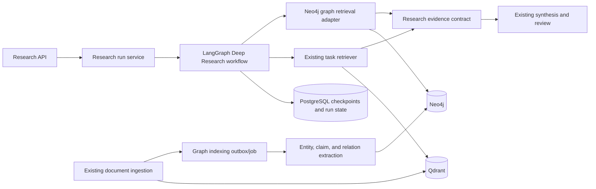

Recommended operational choices:

- Use one Neo4j database with mandatory `owner_id`/`corpus_id` predicates for the MVP, unless infrastructure supports isolated databases per tenant.
- Never send unrestricted user-authored Cypher directly to Neo4j.
- Use parameterized, allowlisted Cypher templates for the local path.
- Keep Text2Cypher disabled initially; if later enabled, validate generated Cypher against allowed labels, relationship types, properties, read-only operations, hop limits, and row limits.
- Store canonical Qdrant `chunk_id` values on Neo4j `Chunk` nodes so graph hits can be resolved through the existing source and citation pipeline.

Neo4j’s official GraphRAG package supports vector, hybrid, vector-plus-Cypher, Text2Cypher, tool-selection, and external Qdrant-to-Neo4j retrieval patterns. The external Qdrant pattern fits this project particularly well because Qdrant can remain the canonical vector store: [Neo4j GraphRAG Python RAG guide](https://neo4j.com/docs/neo4j-graphrag-python/current/user_guide_rag.html).

### 17.3 Graph ingestion flow

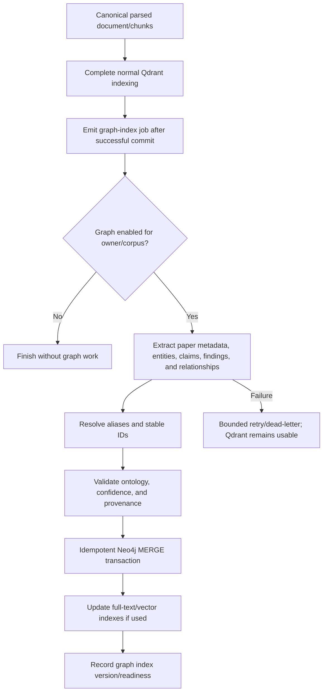

Implementation rules:

- The graph pipeline starts only after normal document ingestion succeeds.
- Graph failures never roll back or block current retrieval.
- Use an outbox or durable job table rather than an in-process background task.
- Make writes idempotent with stable IDs such as `owner_id + document_id + entity_type + canonical_key`.
- On document update, invalidate relationships derived exclusively from the old content hash before publishing the new graph version.
- On document deletion or access change, remove or hide every derived node/edge and verify that no cross-owner path remains.
- Run entity resolution separately from extraction so aliases such as dataset abbreviations, DOI forms, author-name variants, and method acronyms can be improved without reprocessing all prose.

Illustrative constraints and indexes:

```cypher
CREATE CONSTRAINT paper_identity IF NOT EXISTS
FOR (p:Paper) REQUIRE (p.owner_id, p.paper_id) IS UNIQUE;

CREATE CONSTRAINT chunk_identity IF NOT EXISTS
FOR (c:Chunk) REQUIRE (c.owner_id, c.chunk_id) IS UNIQUE;

CREATE INDEX entity_lookup IF NOT EXISTS
FOR (e:Entity) ON (e.owner_id, e.canonical_name);
```

The exact syntax must be verified against the deployed Neo4j version during implementation.

### 17.4 LangGraph state additions

Only compact, JSON-serializable references should enter checkpointed state.

```python
class GraphRetrievalState(TypedDict, total=False):
    graph_mode: Literal["off", "auto", "local", "global"]
    graph_route_reason: str
    graph_query_type: Literal["relationship", "multi_hop", "global", "not_applicable"]
    graph_seed_ids: list[str]
    graph_path_refs: list[dict[str, object]]
    graph_chunk_ids: list[str]
    graph_latency_ms: float
    graph_index_version: str
    graph_error: str | None
```

Do not checkpoint:

- Neo4j driver/session objects;
- full graph subgraphs;
- complete source documents;
- unrestricted Cypher strings generated by a model;
- embeddings.

### 17.5 LangGraph query-time nodes

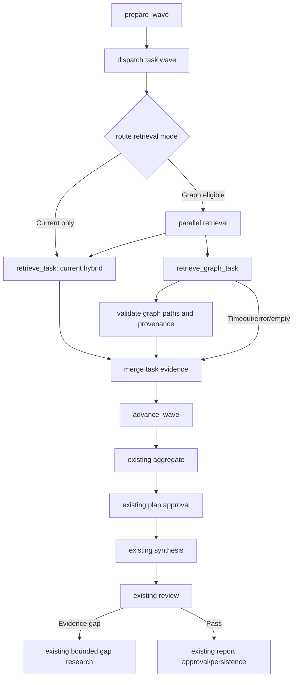

| Node | Behavior | Failure behavior |
|---|---|---|
| `route_retrieval_mode` | Deterministically inspect task type first; optionally use a small structured classifier for ambiguous cases | Return `current_only` |
| `retrieve_task` | Keep existing retrieval implementation unchanged | Existing behavior |
| `retrieve_graph_task` | Resolve seed entities, run bounded Cypher traversal, and collect source chunk IDs/path metadata | Return empty graph result with error metadata |
| `validate_graph_evidence` | Require owner scope, path length, relationship allowlist, confidence threshold, and chunk provenance | Drop invalid paths |
| `merge_task_evidence` | Deduplicate by canonical chunk ID, preserve graph-path metadata, and apply evidence/candidate limits | Prefer existing evidence if graph merge fails |
| `review` | Optionally identify a missing relation/claim and formulate one bounded graph-aware follow-up | Existing gap-limit behavior remains authoritative |

### 17.6 Retrieval adapter

The Neo4j adapter should return the current platform’s evidence model, not Neo4j-specific objects.

```python
class Neo4jResearchRetriever:
    async def retrieve(
        self,
        *,
        owner_id: UUID,
        corpus_id: UUID | None,
        question: str,
        task_type: str,
        top_k: int,
        max_hops: int = 2,
    ) -> ResearchTaskResult:
        # 1. Resolve seed entities using exact/full-text/vector lookup.
        # 2. Select an allowlisted Cypher template for task_type.
        # 3. Execute a read transaction with timeout and result limits.
        # 4. Resolve every returned path to canonical source chunk IDs.
        # 5. Return ResearchEvidenceReference items with path metadata.
        ...
```

Example of a bounded relationship query:

```cypher
MATCH (seed:Entity {owner_id: $owner_id})
WHERE seed.entity_id IN $seed_ids
MATCH (seed)<-[:SUBJECT]-(assertion:Assertion)-[:OBJECT]->(related:Entity)
WHERE assertion.owner_id = $owner_id
  AND assertion.relation_type IN $allowed_relation_types
  AND assertion.confidence >= $min_confidence
MATCH (chunk:Chunk {owner_id: $owner_id})-[:EVIDENCES]->(assertion)
RETURN
  properties(seed) AS subject,
  properties(assertion) AS assertion,
  properties(related) AS object,
  collect(DISTINCT chunk.chunk_id)[0..$chunk_limit] AS chunk_ids
LIMIT $path_limit;
```

For a two-hop query, the adapter can issue a second bounded expansion from the first result set or use another audited template with two `Assertion` segments. Reified assertions are preferable when multiple sources, confidence values, review states, or contradictory extractions must be represented cleanly.

### 17.7 Recommended evidence model for Neo4j

For research, use reified assertions:

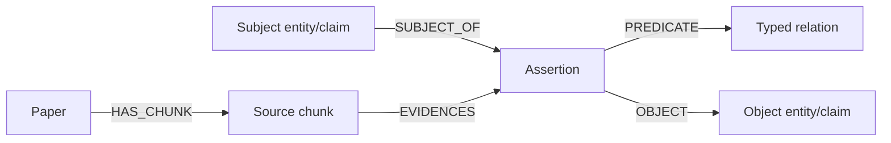

An `Assertion` can store:

- relation type such as `SUPPORTS`, `CONTRADICTS`, `USES`, or `EXTENDS`;
- confidence;
- extraction/review status;
- temporal scope;
- source count;
- extraction model and version;
- created and superseded timestamps.

This is more verbose than direct edges, but it is safer for scholarly provenance and conflicting evidence.

### 17.8 Feature flags and routing

| Control | Suggested values | Purpose |
|---|---|---|
| `graph_rag_enabled` | Boolean deployment kill switch | Prevent any Neo4j request |
| `graph_rag_indexing_enabled` | Boolean | Permit sidecar graph construction independently of serving |
| `graph_rag_shadow_mode` | Boolean | Execute and measure graph retrieval without affecting answers |
| Tenant/corpus capability | Boolean | Ensure only indexed and authorized corpora can use graph retrieval |
| Request mode | `off`, `auto`, `local`, `global` | Explicit caller control |
| `graph_rag_max_hops` | Default 2 | Bound traversal |
| `graph_rag_timeout_ms` | Local target 100–150 ms | Bound request impact |
| `graph_rag_path_limit` | Small fixed maximum | Bound memory and context |
| `graph_rag_min_confidence` | Calibrated threshold | Exclude weak inferred relationships |

Routing policy:

```text
if deployment switch is off:
    current retrieval only
elif owner/corpus graph is not ready:
    current retrieval only
elif request mode is off:
    current retrieval only
elif request mode is local:
    current + local graph in parallel
elif request mode is global and runtime is Deep Research:
    graph community/global workflow
elif request mode is auto and task is relationship/multi-hop:
    current + local graph in parallel
else:
    current retrieval only
```

### 17.9 Security, correctness, and observability

| Concern | Required control |
|---|---|
| Cross-tenant traversal | Apply `owner_id`/corpus scope to seeds, every traversed relationship, evidence chunks, and returned nodes; test adversarially |
| Cypher injection | Parameterized templates; no raw user Cypher; validate and allowlist any future Text2Cypher |
| Write access | Query service uses read-only Neo4j credentials; indexing worker owns write credentials |
| Prompt injection in sources | Treat extracted source text and graph properties as untrusted evidence, never system instructions |
| Unsupported graph claims | A graph fact cannot enter synthesis without at least one accessible source chunk |
| Stale edges | Content-hash/version tracking, tombstones, reindex status, and freshness displayed in trace metadata |
| Overconfident extraction | Confidence, model version, review status, and contradictory assertions retained |
| Runaway traversals | Hop, row, candidate, timeout, memory, and LangGraph recursion limits |
| Debugging | Trace route decision, Cypher template ID, index version, seeds, path count, dropped paths, chunk IDs, latency, and fallback reason |

### 17.10 Implementation sequence

| Step | Change | Why this order |
|---|---|---|
| 1 | Define research ontology and graph-specific benchmark | Prevent building a graph that cannot answer target questions |
| 2 | Add Neo4j driver, health check, settings, read/write credential separation | Establish an isolated infrastructure boundary |
| 3 | Build shadow ingestion for `Paper`, `Chunk`, authors, concepts, methods, and datasets | Start with mostly objective relationships |
| 4 | Add source-backed assertions for claims/findings | Introduce semantic extraction only after provenance works |
| 5 | Implement `Neo4jResearchRetriever` with allowlisted local Cypher templates | Avoid premature Text2Cypher risk and latency |
| 6 | Add a parallel graph branch around the existing `retrieve_task` boundary | Preserve the current retrieval and evidence contracts |
| 7 | Run shadow query evaluation | Measure routing, path accuracy, latency, and incremental evidence |
| 8 | Enable explicit `local` opt-in for selected corpora | Controlled production validation |
| 9 | Enable `auto` only for validated relationship/multi-hop task classes | Prevent broad latency/cost regression |
| 10 | Experiment with communities/global search in asynchronous Deep Research | Keep the most expensive capability outside the interactive path |

Neo4j publishes an official `langchain-neo4j` partner integration and documents `Neo4jGraph`, Neo4j-backed vector search, and graph/Cypher question answering. Those components may accelerate implementation, but the architecture should continue to depend on ResearchMind’s own retrieval and evidence interfaces rather than expose framework-specific objects: [LangChain–Neo4j partner package](https://neo4j.com/blog/developer/langchain-neo4j-partner-package-graphrag/).

## 18. Phased implementation plan

| Phase | Scope | Exit criterion |
|---|---|---|
| 0. Benchmark first | Add graph-oriented queries and ground-truth evidence paths; measure current hybrid and Deep baselines. | Known baseline failure rate and target quality/latency budget |
| 1. Shadow graph build | PostgreSQL graph schema, async sidecar extraction, provenance, owner isolation, local traversal; no answer impact. | Extraction/path accuracy and indexing cost meet thresholds |
| 2. Shadow query | Run graph retrieval for eligible queries, record candidates and latency, but continue serving current answers. | p95 branch latency and route accuracy meet thresholds |
| 3. Explicit opt-in | Add request `graph_mode=local`; fuse graph evidence with existing hybrid candidates and rerank. | A/B shows material target-slice lift with no citation/security regression |
| 4. Auto local routing | Enable only for validated relationship/multi-hop slices with kill switch and fallback. | Sustained quality lift and bounded latency/cost |
| 5. Deep/global experiment | Community detection, summaries, and global search behind asynchronous Deep Research. | Completeness gains justify indexing and per-query LLM cost |
| 6. Infrastructure review | Decide whether PostgreSQL remains sufficient or a dedicated graph store is justified. | Evidence from graph size, traversal p95, operational load, and query complexity |

## 19. Recommended final design

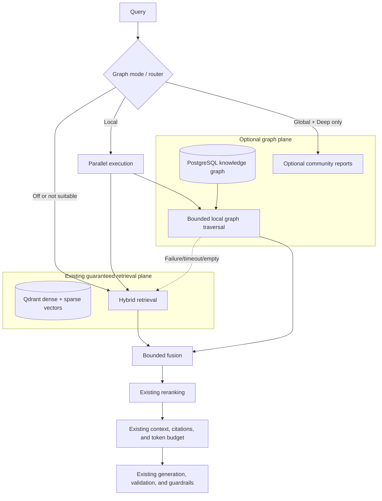

## 20. Final recommendation

GraphRAG is technically compatible with ResearchMind's current architecture, but a full standard GraphRAG implementation should **not** be added wholesale to every request.

The recommended approach is:

- preserve the existing hybrid retrieval path as the default and fallback;
- add a PostgreSQL-backed local relationship graph as an asynchronous sidecar;
- attach source-chunk provenance to every node and edge;
- route only relationship and multi-hop queries to it;
- execute local graph retrieval in parallel with current hybrid retrieval;
- cap traversal depth, candidate count, and latency;
- reuse current fusion, reranking, context, citations, generation, validation, and observability;
- keep global/community search inside explicit asynchronous Deep Research;
- begin with shadow evaluation and promote only after graph-specific benchmarks show a meaningful quality lift.

The investment is justified when the platform has a meaningful volume of relational, multi-document, or corpus-level questions and current hybrid/decomposition retrieval demonstrably misses connecting evidence. If most traffic remains single-document factual search, current hybrid retrieval and reranking will usually provide a better quality-to-complexity ratio.

## 21. Adaptive RAG routing for the optional GraphRAG path

### 21.1 Recommendation

Adaptive RAG is the recommended mechanism for deciding whether a particular query or Deep Research task should use GraphRAG.

The controls should operate at two levels:

1. **Explicit control**
   - A deployment, tenant, corpus, or request can force GraphRAG off.
   - An authorized request can explicitly select local GraphRAG.
   - Global/community GraphRAG can be explicitly selected only for asynchronous Deep Research.
2. **Adaptive control**
   - When the request uses `graph_mode=auto`, a router classifies the query or individual research task.
   - Only validated relationship, lineage, contradiction, coverage, or multi-hop query classes are sent to GraphRAG.
   - All other queries continue through the existing retrieval path.

This provides the value of GraphRAG without imposing its latency and cost on every request.

### 21.2 Control precedence

Explicit controls must always override the adaptive router.

| Priority | Control | Behavior |
|---:|---|---|
| 1 | Deployment kill switch is off | Never call Neo4j or any graph service |
| 2 | Owner/corpus is unauthorized or graph index is not ready | Use current retrieval only |
| 3 | Request mode is `off` | Use current retrieval only, regardless of router prediction |
| 4 | Request mode is `local` | Run current hybrid and bounded local GraphRAG in parallel |
| 5 | Request mode is `global` and runtime is Deep Research | Run the explicit global/community graph workflow |
| 6 | Request mode is `global` outside Deep Research | Reject or downgrade to `local`; do not silently run an expensive global workflow |
| 7 | Request mode is `auto` | Invoke the Adaptive RAG policy |
| 8 | Router is uncertain, fails, or times out | Default to current retrieval only |

Suggested request contract:

```json
{
  "graph_mode": "off | auto | local | global"
}
```

Recommended defaults:

| Product surface | Default |
|---|---|
| Chat | `off` |
| Linear Research | `auto`, after shadow evaluation proves the router |
| Deep Research task retrieval | `auto` per task |
| Explicit relationship explorer | `local` |
| Corpus-wide theme/community report | `global`, explicit and asynchronous only |

### 21.3 Adaptive routing flow

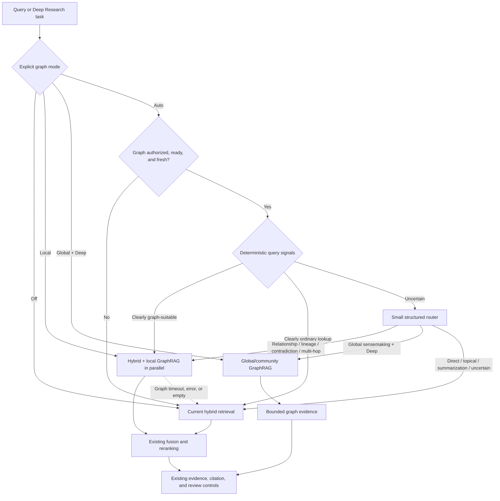

### 21.4 Query classes

| Query class | Examples or indicators | Selected path | Rationale |
|---|---|---|---|
| Direct factual | “What accuracy did Paper A report?” | Current hybrid | Relevant passage retrieval is sufficient |
| Known-item lookup | DOI, exact title, named author, named section | Sparse/metadata/current hybrid | Exact search is simpler and faster |
| Single-document summary | “Summarize this uploaded paper” | Current document path | Relationships are not required |
| General topical search | “Find papers about retrieval evaluation” | Current hybrid | Semantic and keyword retrieval fit the task |
| Independent comparison | “Compare the conclusions of Paper A and Paper B” | Current Deep Research first | Decomposition and synthesis can usually resolve it |
| Relationship | “How is Method A related to Dataset B?” | Hybrid + local GraphRAG | Explicit path can connect evidence |
| Citation or method lineage | “Which methods extend Paper A through intermediate work?” | Hybrid + local GraphRAG | Multi-hop traversal is central to the question |
| Contradiction/evidence map | “Which findings contradict Claim C, and under what populations?” | Hybrid + local GraphRAG | Requires typed claim and study relationships |
| Dataset derivation/leakage | “Do these benchmarks derive from the same source dataset?” | Hybrid + local GraphRAG | Alias resolution and lineage traversal add material value |
| Systematic-review coverage | “Which PICO combinations are absent?” | Local GraphRAG plus Deep Research validation | Structured absence/coverage query is needed |
| Corpus-wide theme or community | “What major schools of thought exist across this corpus?” | Explicit global GraphRAG in Deep Research | Community summaries/global aggregation fit the task |
| Fresh/current question | “What papers were published this week?” | Web/current retrieval | Graph freshness may lag |
| Ambiguous query | “How are these related?” without resolvable referents | Clarify or current path | The router should not invent graph seeds |

### 21.5 Router implementation

Use a two-stage router to minimize latency and cost.

#### Stage A: deterministic rules

Route without an LLM when signals are clear:

- explicit `graph_mode`;
- Deep Research task type from the existing validated plan;
- named relationship intent such as “connected,” “influenced,” “derived from,” “contradicts,” “extends,” “lineage,” or “through which”;
- request for a path, network, dependency, genealogy, coverage matrix, or research community;
- multiple identified entities plus a relationship predicate;
- corpus/index readiness and freshness;
- query types known not to need a graph, including summarization or exact identifier lookup.

#### Stage B: structured classifier

Invoke a small router model only when deterministic signals are inconclusive. It should return a schema such as:

```python
class RetrievalRoute(BaseModel):
    route: Literal[
        "current",
        "hybrid_plus_local_graph",
        "global_graph_deep_research",
        "clarify",
    ]
    query_class: Literal[
        "direct",
        "topical",
        "relationship",
        "multi_hop",
        "lineage",
        "contradiction",
        "coverage",
        "global_sensemaking",
        "ambiguous",
    ]
    confidence: float
    required_entities: list[str]
    reason_code: str
```

Routing rules:

- select GraphRAG only above a calibrated confidence threshold;
- if required entities cannot be resolved, fall back or clarify;
- do not accept free-form execution instructions from the router;
- do not allow the router to generate or execute Cypher;
- record the reason code rather than relying on a prose explanation;
- cache safe routing decisions for normalized repeated queries;
- use current retrieval on parse failure, timeout, low confidence, or unknown class.

### 21.6 Integration with the existing LangGraph research workflow

The most effective routing granularity differs by runtime:

| Runtime | Routing granularity | Integration point |
|---|---|---|
| Linear Research | Once per user query | Before `RetrievalService.search_hybrid()` |
| Deep Research | Once per planned research task | Immediately before the current `retrieve_task` execution |
| Gap research | Once for the reviewer-generated missing-evidence question | Before `retrieve_gap_task` |
| Related-paper suggestions | Once for the suggestion objective | Before the existing related-paper retrieval |

Per-task routing is important for Deep Research. One research plan may contain:

- a direct fact task that should use current hybrid retrieval;
- a citation-lineage task that should add local GraphRAG;
- a recent-evidence task that should use approved web search;
- a corpus-theme task that may use global GraphRAG.

Routing the entire research run to one retriever would lose the main benefit of Adaptive RAG.

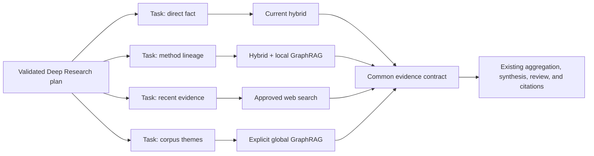

### 21.7 Why Adaptive RAG is better than always-on GraphRAG

| Criterion | Always-on GraphRAG | Explicit controls + Adaptive RAG |
|---|---|---|
| Simple-query latency | Every query pays graph overhead | Simple queries remain on the current fast path |
| Graph serving cost | Paid for all traffic | Paid only for eligible queries/tasks |
| Failure surface | Neo4j becomes part of every request | Neo4j remains an optional sidecar |
| Quality | Can add noisy graph context to direct questions | Graph evidence is limited to query classes where it is useful |
| User control | Limited | Users or callers can force `off`, `local`, or `global` |
| Experimentation | Harder to isolate benefit | `auto`, explicit modes, and shadow mode support clean A/B evaluation |
| Deep Research | One coarse retrieval strategy | Different tasks can use different evidence sources |
| Rollback | Requires removing a core dependency | Deployment kill switch immediately restores the existing path |

### 21.8 Router risks and controls

| Risk | Effect | Control |
|---|---|---|
| False positive | Unnecessary graph latency/cost and possible noisy evidence | Conservative threshold; current hybrid always runs in local mode |
| False negative | Missed relationship evidence | Evaluate graph-oriented recall; allow explicit `local` override |
| Router drift | Model or prompt changes alter traffic allocation | Version the router, maintain a labeled route dataset, and gate changes |
| Corpus not ready | Router selects a graph with incomplete/stale data | Readiness and freshness check before classification result is honored |
| Ambiguous entity | Wrong seed leads to an irrelevant graph neighborhood | Entity-resolution confidence threshold or clarification |
| Over-routing Deep Research | Many tasks invoke Neo4j and increase tail latency | Per-run graph-call and graph-latency budgets |
| Hidden failure | Graph branch silently contributes nothing | Trace selected route, candidate/path counts, fallback, and incremental evidence |

### 21.9 Evaluation metrics for the adaptive router

| Metric | What it measures |
|---|---|
| Route accuracy | Agreement with a human-labeled optimal retrieval path |
| Graph precision | Percentage of graph-routed queries that actually benefit from graph evidence |
| Graph recall | Percentage of graph-beneficial queries that the router sends to GraphRAG |
| False-positive overhead | Added latency and cost on queries that did not benefit |
| Incremental evidence rate | Graph-routed queries where GraphRAG adds at least one relevant, nonduplicate source chunk/path |
| Target-slice answer lift | Accuracy and completeness gain on relationship/multi-hop queries |
| Blended answer lift | Quality gain across all traffic after accounting for route frequency |
| Fallback success rate | Graph failures that still return a valid current-path answer |
| Router latency | p50/p95 time added before retrieval starts |
| Per-run graph budget utilization | Number and duration of graph calls in Deep Research |

### 21.10 Final position on the idea

The Adaptive RAG proposal strengthens the GraphRAG recommendation.

- Explicit `off`, `local`, and `global` modes provide predictable product and operational control.
- `auto` mode prevents ordinary research queries from paying GraphRAG’s cost.
- Per-task routing fits the existing LangGraph Deep Research architecture better than routing an entire run.
- The current hybrid retriever remains the default and failure fallback.
- Neo4j remains optional rather than becoming a mandatory dependency.
- Global GraphRAG remains explicit and asynchronous.

With this design, the recommendation remains **6.5/10 for adding GraphRAG to the platform today**, but the **scoped Adaptive RAG + local GraphRAG implementation is rated 8/10** because it improves the expected quality-to-latency and quality-to-cost tradeoff while preserving explicit control.
