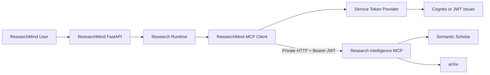
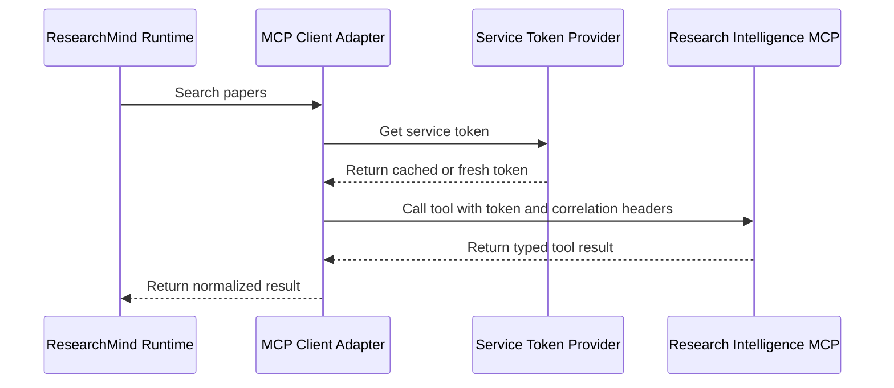

# ResearchMind — Research Intelligence MCP Integration PRD

**Target repository:** `researchmind`
**Implementation tool:** Claude Code
**Primary integration:** Research Intelligence MCP
**Remote transport:** Streamable HTTP
**Authentication:** Service-to-service bearer JWT
**Deployment dependency:** Private AWS ECS Service Connect endpoint

---

## Document Boundary

This PRD contains the changes owned by the `researchmind` repository.

The companion MCP server PRD is:

```text
remote_mcp_deployment_prd.md
```

The two PRDs together preserve the complete scope and instructions from:

```text
remote_mcp_deployment_and_researchmind_integration_prd.md
```

ResearchMind owns service-token acquisition, the typed MCP client adapter, runtime integration, retry and timeout behavior, error normalization, correlation propagation, and the cross-repository end-to-end smoke test.

---

## 1. Goal

Integrate the ResearchMind backend with the privately deployed Research Intelligence MCP service through Streamable HTTP while keeping ResearchMind responsible for user authentication, research orchestration, session context, authorization decisions, and product behavior.

The completed integration must support:

```text
ResearchMind Backend
    -> private Streamable HTTP + bearer JWT
    -> Research Intelligence MCP
    -> Semantic Scholar / arXiv
```

ResearchMind must never construct raw MCP protocol payloads in business or runtime code. All MCP communication must be isolated behind a typed client adapter.

---

## 2. Deliverables

- [ ] ResearchMind MCP settings
- [ ] Service-token provider
- [ ] Typed Research Intelligence MCP client
- [ ] Streamable HTTP connection
- [ ] JWT bearer-token attachment
- [ ] Correlation ID propagation
- [ ] Timeout policy
- [ ] Retry policy
- [ ] Error normalization
- [ ] Research runtime integration
- [ ] Integration tests
- [ ] ResearchMind end-to-end smoke tests

---

## 3. Target Architecture



The MCP endpoint must remain private. ResearchMind accesses it through ECS Service Connect or an equivalent private service-discovery mechanism.

---

## 4. Implementation Rules

1. Inspect the existing ResearchMind repository before editing.
2. Reuse existing settings, dependency injection, authentication, observability, retry, and lifecycle abstractions.
3. Do not duplicate the Research Intelligence MCP server implementation inside ResearchMind.
4. Do not construct raw MCP JSON-RPC messages in business logic.
5. Isolate MCP communication behind a typed client adapter.
6. Use official MCP or FastMCP client APIs supported by the installed version.
7. Use Pydantic v2 settings and typed response models.
8. Keep all network operations asynchronous.
9. Do not log service tokens, user tokens, API keys, or complete sensitive research queries.
10. Propagate request and correlation IDs.
11. Add unit, integration, and end-to-end smoke tests.
12. Run the full ResearchMind quality gate before completion.

---

# MCP Server Contract Required by ResearchMind

The ResearchMind implementation depends on the following server-side contract from `remote_mcp_deployment_prd.md`.

## Endpoint

```text
http://research-intelligence-mcp:8000/mcp
```

The exact DNS suffix may depend on the ECS Service Connect namespace.

## Health Endpoints

```text
GET /health
GET /ready
GET /metrics
```

ResearchMind may use `/ready` for integration readiness checks. It must not call live providers to determine readiness.

## JWT Contract

```env
MCP_JWT_ISSUER=https://issuer.example.com/
MCP_JWT_AUDIENCE=research-intelligence-mcp
MCP_JWT_REQUIRED_SCOPE=research-intelligence/invoke
MCP_JWKS_URL=https://issuer.example.com/.well-known/jwks.json
```

Required token validation on the MCP server:

- bearer scheme;
- token structure;
- signature;
- allowed signing algorithm;
- issuer;
- audience;
- expiration;
- not-before when present;
- required scope.

Expected status behavior:

```text
401 — missing, malformed, invalid, or expired token
403 — valid token without required scope
```

ResearchMind user tokens must not be forwarded as the MCP service credential.

## Correlation Header Contract

```http
X-Request-ID: 4ab885d4-8da2-4b66-9154-30505eb44e76
X-Correlation-ID: research-session-123
```

Rules:

- request ID represents one HTTP request;
- correlation ID represents the broader research operation or session;
- maximum length is 128 characters;
- control characters and line breaks are prohibited;
- identifiers must not be used as metric labels;
- the MCP server returns both headers in the response.

## Stable Tool Contract

The client adapter should expose typed methods for:

```python
async def search_papers(...)
async def get_paper(...)
async def get_paper_citations(...)
async def get_paper_references(...)
async def get_related_papers(...)
async def resolve_paper_access(...)
```

The adapter must preserve structured partial failures returned by the MCP server.

---

# Milestone 8 — ResearchMind MCP Client

## Objective

Add a typed client adapter inside the ResearchMind repository.

## Suggested Location

```text
src/researchmind/integrations/research_intelligence/
├── __init__.py
├── auth.py
├── client.py
├── errors.py
├── models.py
└── settings.py
```

Adapt the root package name to the actual ResearchMind repository.

## Responsibilities

- connect through Streamable HTTP;
- attach bearer token;
- attach request and correlation IDs;
- list tools during startup or readiness validation;
- expose typed methods for stable tools;
- validate tool outputs;
- enforce timeouts;
- normalize transport and protocol errors;
- retry safe failures only;
- close client sessions cleanly.

## Settings

```env
RESEARCH_INTELLIGENCE_MCP_ENABLED=true
RESEARCH_INTELLIGENCE_MCP_URL=http://research-intelligence-mcp:8000/mcp
RESEARCH_INTELLIGENCE_MCP_TIMEOUT_SECONDS=30
RESEARCH_INTELLIGENCE_MCP_CONNECT_TIMEOUT_SECONDS=5
RESEARCH_INTELLIGENCE_MCP_MAX_RETRIES=2
RESEARCH_INTELLIGENCE_MCP_REQUIRED_SCOPE=research-intelligence/invoke
```

## Application Interface

Expose typed methods such as:

```python
async def search_papers(...)
async def get_paper(...)
async def get_paper_citations(...)
async def get_paper_references(...)
async def get_related_papers(...)
async def resolve_paper_access(...)
```

ResearchMind business logic must not construct raw MCP JSON-RPC payloads.

## Authentication Flow



## Token Provider Rules

- cache the token until shortly before expiration;
- refresh under a lock to avoid refresh stampedes;
- never log tokens;
- refresh after a 401 only once;
- distinguish authentication failures from provider failures.

## Retry Policy

Retry only:

- connection reset;
- temporary DNS failure;
- HTTP 502, 503, or 504;
- explicit retryable MCP transport errors.

Do not automatically retry:

- 400;
- 401 after one token refresh;
- 403;
- validation errors;
- future non-idempotent tools.

Use exponential backoff with jitter.

## Error Categories

```text
authentication_error
authorization_error
transport_error
timeout_error
protocol_error
validation_error
provider_error
rate_limit_error
unavailable_error
```

## Acceptance Criteria

- [ ] ResearchMind calls all stable tools.
- [ ] Token retrieval is cached.
- [ ] Correlation IDs propagate.
- [ ] Timeouts are bounded.
- [ ] Retry behavior is tested.
- [ ] Tool responses are validated.
- [ ] Client shutdown is verified.
- [ ] Integration can be disabled through settings.

---

# Milestone 9 — Deployment Smoke Tests

## Objective

Verify the complete deployed system.

## Level 1 — Local Container Smoke Test

Verify:

- `/health`;
- `/ready`;
- `/metrics`;
- MCP session initialization;
- tool discovery;
- authenticated tool invocation;
- graceful shutdown.

## Level 2 — ECS Smoke Test

Run from ResearchMind or another private VPC task:

1. resolve Service Connect DNS;
2. call `/health`;
3. call `/ready`;
4. obtain a service token;
5. initialize MCP;
6. list tools;
7. call `health_check`;
8. call `search_papers` with a small limit;
9. call `get_paper` for one returned paper;
10. validate response schemas;
11. verify response correlation headers;
12. verify CloudWatch logs and metrics.

## Level 3 — ResearchMind End-to-End Smoke Test

1. Start a ResearchMind research operation.
2. Invoke the ResearchMind MCP client.
3. Search Semantic Scholar and arXiv.
4. Receive canonical results.
5. Preserve structured partial failures.
6. Return results to the research runtime.
7. Confirm one correlation ID spans ResearchMind and MCP logs.

## Test Safety

- use a stable query;
- use result limit `2`;
- use strict timeouts;
- never print credentials;
- return non-zero exit status on failure;
- keep live tests separate from normal unit tests.

Suggested query:

```text
retrieval augmented generation
```

## Acceptance Criteria

- [ ] Local container smoke test passes.
- [ ] ECS staging smoke test passes.
- [ ] ResearchMind integration smoke test passes.
- [ ] Failure output is actionable.
- [ ] Commands and environment variables are documented.

---

# Sensitive Logging Rules

## Never Log

- authorization headers;
- bearer tokens;
- JWT payloads;
- cookies;
- API keys;
- raw environment variables;
- full request headers;
- user access tokens;
- raw upstream response bodies in production.

## Query Logging

Do not log complete research queries by default in production. Prefer:

```json
{
  "query_length": 148,
  "query_hash": "sha256-prefix",
  "top_k": 5
}
```

## Redaction Keys

Redact case-insensitively:

```text
authorization
proxy-authorization
cookie
set-cookie
api-key
apikey
api_key
token
access_token
refresh_token
client_secret
password
secret
semantic_scholar_api_key
```

## Error Logs

Prefer:

```text
error_type
provider
operation
retryable
status_code
```

Avoid raw exception payloads when they may contain upstream request data.

---

# Suggested Repository Changes

Adapt the root package name to the actual ResearchMind repository.

```text
src/researchmind/integrations/research_intelligence/
├── __init__.py
├── auth.py
├── client.py
├── errors.py
├── models.py
├── service.py
└── settings.py

tests/
├── unit/
│   └── integrations/
│       └── research_intelligence/
├── integration/
│   └── test_research_intelligence_mcp.py
└── smoke/
    └── test_research_intelligence_mcp_e2e.py
```

Reuse existing ResearchMind modules when equivalent abstractions already exist.

---

# Implementation Order

## Phase D — ResearchMind

21. Add ResearchMind MCP settings.
22. Add service token provider.
23. Add typed MCP client adapter.
24. Add retry and error normalization.
25. Add integration tests.
26. Run end-to-end smoke tests.
27. Add operational documentation.

## Recommended Internal Order

1. Inspect existing ResearchMind integration and settings conventions.
2. Add MCP settings and validation.
3. Add service-token acquisition and caching.
4. Add the Streamable HTTP MCP client wrapper.
5. Add typed tool methods.
6. Add timeout, retry, and error normalization.
7. Add correlation propagation.
8. Integrate the client with the research runtime.
9. Add readiness behavior.
10. Add unit and integration tests.
11. Run the ResearchMind-to-MCP end-to-end smoke test.
12. Document deployment configuration and operational failure modes.

---

# Quality Gates

Use the existing ResearchMind quality commands. At minimum, run the repository equivalents of:

```bash
uv run ruff format --check src tests
uv run ruff check src tests
uv run mypy src
uv run pytest
uv build --no-sources
```

When the ResearchMind repository has additional frontend, migration, or integration checks, run those as well.

All commands must pass before the milestone is marked complete.

---

# Definition of Done

## ResearchMind

- [ ] MCP client adapter is implemented
- [ ] service-token authentication is implemented
- [ ] typed tool methods are implemented
- [ ] timeout and retry policies are implemented
- [ ] errors are normalized
- [ ] correlation IDs are propagated
- [ ] structured partial failures are preserved
- [ ] runtime integration is complete
- [ ] client shutdown is verified
- [ ] integration can be disabled through settings

## Validation

- [ ] ResearchMind can resolve the private MCP endpoint
- [ ] authenticated MCP initialization succeeds
- [ ] tool discovery succeeds
- [ ] `health_check` succeeds
- [ ] `search_papers` succeeds
- [ ] `get_paper` succeeds for one returned result
- [ ] ResearchMind end-to-end smoke test passes
- [ ] one correlation ID spans ResearchMind and MCP logs
- [ ] Ruff passes
- [ ] Mypy passes
- [ ] Pytest passes
- [ ] package build passes

---

# Claude Code Final Report

After implementation, provide:

1. Files created
2. Files modified
3. Architecture decisions
4. New environment variables
5. Service-token acquisition design
6. MCP client design
7. Retry and timeout rules
8. Error normalization rules
9. Correlation propagation behavior
10. Commands executed
11. Ruff result
12. Mypy result
13. Pytest result
14. Package build result
15. ResearchMind integration smoke-test result
16. Known limitations
17. Remaining deployment dependencies
18. MCP server contract assumptions

---

# Final Roadmap Update

Mark the ResearchMind repository milestone complete only after the client, runtime integration, and end-to-end smoke test pass.

```markdown
# Research Intelligence MCP Integration

**Status:** ✅ Completed

## Deliverables

- [x] MCP client settings
- [x] Service token provider
- [x] Typed MCP client
- [x] Retry policies
- [x] Timeout policies
- [x] Error normalization
- [x] Correlation ID propagation
- [x] Runtime integration
- [x] Integration tests
- [x] End-to-end smoke tests
```

The overall cross-repository milestone is complete only after the companion MCP deployment PRD is also complete.
