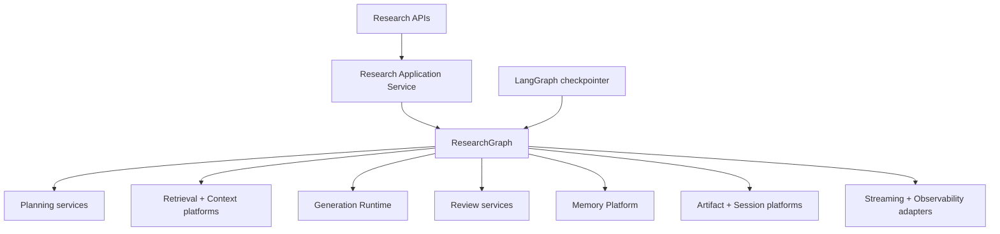
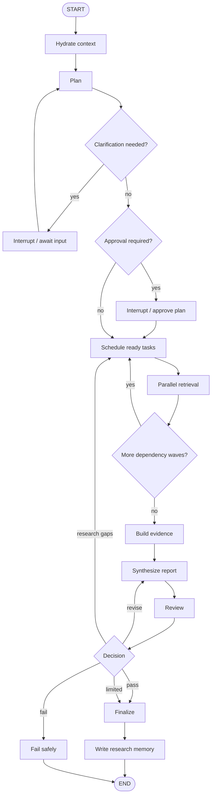

# ResearchMind Research Runtime — Implementation Plan

**Status:** Ready for implementation  
**Date:** 2026-07-19  
**Target:** Phase 6 — Research Runtime  
**Current product baseline:** Cost-aware Memory Platform implemented; linear `/research` flow implemented; Retrieval, Context, Generation Runtime, Validation, Guardrails, Streaming, Artifacts, Observability, and Evaluation foundations already exist.

## 0. Review Addendum — 2026-07-19

This plan was reviewed against the current repository and the companion
`Research Runtime.md` design note.

Confirmed current facts:

- `langgraph` is importable through the current dependency set, and
  `StateGraph`, `Send`, `Command`, `interrupt`, `ToolNode`, and the
  in-memory checkpointer are available.
- `langgraph.checkpoint.postgres` is **not** currently importable. Production
  checkpointing therefore requires a dependency spike/addition before it can
  be treated as available.
- The existing `ResearchSession` model is a completed research turn/Q&A record
  (`query`, `answer`, `citations`, `sources` are the public replay payload),
  not yet a long-running runtime lifecycle record.
- Research already has conversation threading and Memory Platform integration:
  `research_conversations`, `ResearchSession.conversation_id`, prompt transcript
  folding, and SESSION memory scoped to the research conversation id.
- Memory retrieval and writing are now policy-owned rather than a side effect of
  every generation: compact SESSION state is non-transcript data; users without
  durable memory short-circuit retrieval; one query embedding feeds parallel
  semantic/research search; and only final user-facing turns may enter the
  extraction orchestrator. Explicit durable interests are eligible immediately;
  generic topics require two distinct sessions and one bounded LLM validation.
- Chat additionally has cursor-paginated replay and deterministic prompt-history
  compaction (ADR-030). Research Runtime must not copy its Chat implementation
  mechanically: graph checkpoint state, evidence references, and report
  artifacts need their own explicit bounded-state policy.
- The Research Runtime must reuse `MemoryExtractionOrchestrator` only after a
  final user-facing answer is persisted. Planner, reviewer, tool, retry, and
  internal helper nodes must be marked ineligible and must not create memory
  writes or extraction cost.
- The remaining gap is not "basic memory"; it is query/goal rewriting,
  planning, decomposition, evidence, review, resumable graph execution,
  approval, and versioned reports.

Corrections made by this review:

- Start with a **compatibility/walking-skeleton milestone** before planner
  prompts or real retrieval fan-out.
- Treat production Postgres checkpointing as a Milestone 6.0 spike, not an
  assumption.
- Prefer a new `research_runs` lifecycle table over mutating the current
  `research_sessions` semantics too early. `research_sessions` can continue to
  represent the public completed turn/report while `research_runs` owns graph
  lifecycle, status, thread IDs, attempts, cancellation, approval state, and
  terminal reasons.
- Build **Research Runtime V1 with V3-compatible boundaries**: one top-level
  graph first, separate domain services and ports now, subgraphs later after the
  workflow proves itself.
- Keep the current linear `/research` path as a feature-flag fallback until the
  graph is evaluated against it.

---

## 1. Executive Decision

Build the remaining Research Runtime as a **single-agent, workflow-driven deep-research system** before introducing a multi-agent platform.

ResearchMind owns the research semantics and public contracts:

- research intent and depth
- plans and subquestions
- evidence and citations
- runtime state schema
- budgets and policies
- research sessions and status
- reviews and reports
- artifacts, events, APIs, evaluation, and memory integration

LangGraph owns the execution mechanics:

- graph execution
- conditional routing
- parallel fan-out
- checkpoints and resume
- interrupts
- event emission
- bounded loops
- reusable subgraphs where state isolation is valuable

This boundary is non-negotiable. LangGraph must not become the domain model, the API contract, the evidence store, or the system of record.

The delivery strategy is a **walking skeleton first**: prove state, graph execution, persistence, and event adaptation with deterministic test nodes; then add Planner, Decomposition, Evidence, Synthesis, and Review behind existing ResearchMind interfaces.

---

## 2. Scope

### In scope

- Planner Platform
- Query Decomposition Platform
- LangGraph Research Workflow Runtime
- dependency-aware parallel retrieval
- Evidence Platform
- Synthesis Platform
- Reviewer Platform
- bounded gap-research and repair loops
- checkpointing, pause, resume, and optional plan approval
- canonical research streaming events
- conversation and memory integration
- migration of the current linear `/research` flow behind the new runtime
- runtime-specific evaluation and production hardening

### Out of scope for this phase

- supervisor-based multi-agent orchestration
- Planner Agent, Research Agent, Reviewer Agent, or Critic Agent as independent autonomous agents
- generic tool marketplace or generic tool executor
- full MCP Platform implementation
- browser automation
- unconstrained autonomous research
- rebuilding Retrieval, Context, Generation, Validation, Guardrails, Artifacts, Observability, Evaluation, Session, or Memory capabilities
- replacing ResearchMind canonical models with LangChain or LangGraph types
- breaking the current `/research` API contract

### Product outcome

The runtime must support this flow:

```text
Research goal
    ↓
Conversation + memory hydration
    ↓
Intent, depth, budget, and plan
    ↓
Subquestions + dependencies
    ↓
Dependency-aware parallel retrieval
    ↓
Evidence normalization + citation preservation
    ↓
Report synthesis
    ↓
Deterministic + model-based review
    ↓
Bounded repair or targeted research
    ↓
Versioned report artifact + reusable research memory
```

---

## 3. Frozen Architecture Boundary



### Ownership table

| Concern | Owner | Rule |
| --- | --- | --- |
| Research plan schema | ResearchMind | Pydantic canonical model |
| Research state contract | ResearchMind | JSON-safe, versioned state |
| Node scheduling | LangGraph | `StateGraph`, edges, commands, fan-out |
| Retrieval behavior | Retrieval Platform | Runtime invokes an existing port |
| Context assembly | Context Platform | Runtime never rebuilds it |
| LLM calls | Generation Runtime | No direct provider SDK calls from nodes |
| Input/output safety | Guardrails + Validation | Existing canonical lifecycle remains mandatory |
| Run snapshots | LangGraph checkpointer | Execution recovery only |
| Research session | Session Platform | Product system of record |
| Long-term memory | Memory Platform | Cross-session knowledge and preferences |
| Evidence provenance | Evidence Platform | Canonical citation-ready records |
| Report persistence | Artifact Platform | Versioned report and supporting artifacts |
| Public streaming schema | Streaming Platform | LangGraph events are adapted, never exposed raw |
| Tracing and metrics | Observability Platform + LangSmith | Framework emits signals; ResearchMind owns metrics |

---

## 4. Architecture Decisions

### RT-001 — Use the LangGraph Graph API

Use `StateGraph` for the Research Runtime because the workflow has explicit stages, shared state, visualization needs, conditional transitions, parallel execution, and review loops.

Do not use the Functional API for the main runtime. It can be considered for isolated utilities later, but mixing both APIs during the first implementation adds no immediate value.

### RT-002 — Single-agent workflow first

The first production runtime is a deterministic workflow with LLM-assisted planning and review, not a collection of agents. Multi-agent work begins only after runtime evaluations demonstrate a limitation that agent specialization can solve.

### RT-003 — Pydantic at boundaries, `TypedDict` inside the graph

- Canonical requests, plans, evidence, reviews, reports, events, and errors use Pydantic.
- `ResearchState` uses `TypedDict` and JSON-safe values.
- Node boundaries validate with `model_validate()` and emit with `model_dump(mode="json")`.
- No provider response objects, database sessions, clients, callbacks, or arbitrary classes enter checkpointed state.

### RT-004 — Compact, bounded checkpoint state

State stores identifiers, status, compact evidence excerpts, scores, summaries, and artifact references. It does not store raw provider responses, full documents, embeddings, duplicated contexts, or large binary artifacts.

Large or reusable payloads belong in ResearchMind-owned stores. State carries references to them.

### RT-005 — Research run/session ownership

Do not overload the current `research_sessions` table until the runtime
lifecycle is proven. Today, `research_sessions` is the public replay record for
a completed research turn/report. Long-running execution needs fields that do
not naturally fit that current shape: status, graph thread id, run id, attempt
number, pause/approval state, cancellation, checkpoint ownership, terminal
reason, and partial-output references.

Preferred model:

```text
research_conversation  → groups user-facing research turns
research_session       → completed public turn/report replay record
research_run           → long-running graph lifecycle record
LangGraph checkpoint   → execution snapshot/resume mechanism
```

Maintain an explicit mapping:

```text
research_run_id      → graph invocation/run
graph_thread_id      → LangGraph configurable.thread_id
research_session_id  → final public replay/report record, nullable until completion
parent_research_id   → completed report this run follows up on, when applicable
conversation_id      → product conversation/thread boundary
```

A completed report follow-up creates a new linked `research_run`. Only an
interrupted, paused, or failed-in-progress run resumes the same graph thread.
The application database remains the system of record for ownership and public
status; the LangGraph checkpointer owns resumable execution snapshots only.

### RT-006 — Postgres checkpointer in production

Use a Postgres checkpointer only after a compatibility spike against the
project's pinned LangGraph and Psycopg versions. Current repository check:
`langgraph.checkpoint.memory` is importable, but
`langgraph.checkpoint.postgres` is not. Milestone 6.0 must therefore verify and
add the correct package (for example the LangGraph Postgres checkpoint package
for the installed `langgraph==1.2.9` family) before using
`AsyncPostgresSaver`/`PostgresSaver` in production code.

Use an in-memory checkpointer only in unit tests and local graph tests.

- provision checkpointer tables outside request handling
- use UUID thread identifiers shorter than 255 characters
- verify pool lifecycle, reconnect behavior, and graceful shutdown
- keep checkpoint retention and deletion policies explicit
- never call schema setup on every application start
- fail safely when checkpoint storage is unavailable; do not mark a run
  resumable if no durable checkpoint was written

### RT-007 — Existing platforms are invoked through ports

Nodes receive a runtime dependency container and call interfaces such as:

```python
planner: ResearchPlanner
decomposer: QueryDecomposer
retrieval: ResearchRetrievalPort
context_builder: ContextBuilderPort
generation_runtime: GenerationRuntimePort
evidence_service: EvidenceService
reviewer: ResearchReviewer
session_service: ResearchSessionPort
run_service: ResearchRunPort
artifact_service: ResearchArtifactPort
memory_service: ResearchMemoryPort
event_publisher: ResearchEventPublisher
```

Nodes contain orchestration glue only. Domain logic remains testable without compiling a graph.

### RT-008 — Hybrid planner and decomposer

Use deterministic heuristics before structured model generation:

1. validate explicit request controls
2. detect obvious quick versus deep research signals
3. choose a default budget profile
4. use structured generation for semantic planning
5. validate and normalize the resulting plan

The LLM may propose a plan; it does not define policy, budgets, permissions, or stop conditions.

### RT-009 — Dependency-aware fan-out

Use dynamic fan-out for subquestions that are ready in the current topological wave. Independent questions run concurrently. Dependent questions wait for their prerequisites.

Never fan out all subquestions blindly. Validate the dependency graph as a DAG before execution and fail planning early on cycles or missing dependency IDs.

### RT-010 — Idempotent parallel reducers

Parallel node updates merge into dictionaries keyed by stable `subquestion_id` or `task_id`. Reducers must be deterministic and idempotent so retries cannot duplicate results.

Append-only list reducers are acceptable only for ordered event logs with explicit event IDs. They are not the default for retrieval results or errors.

### RT-011 — Review routes by failure type

The review result must distinguish:

- `PASS` — finalize
- `REVISE_SYNTHESIS` — evidence is sufficient; regenerate the report only
- `RESEARCH_GAPS` — create targeted follow-up subquestions
- `FINALIZE_WITH_LIMITATIONS` — budget exhausted but a useful qualified report exists
- `FAIL` — no safe or useful result can be produced

The runtime must not respond to every review failure by repeating the entire research run.

### RT-012 — Bounded autonomy

Every run has hard budgets:

- maximum subquestions
- maximum parallel tasks
- maximum retrieval calls
- maximum review iterations
- maximum new gap questions
- maximum generation tokens
- maximum wall-clock duration
- maximum estimated cost

Budget policy is enforced in code before every expensive node. The graph recursion limit is a final safety net, not the primary loop-control mechanism.

### RT-013 — Human approval is policy-driven and optional

Support a plan-approval interrupt, but keep it disabled by default for normal research. Enable it when:

- the user explicitly requests approval
- the estimated cost or duration crosses a configured threshold
- external or sensitive tools are planned
- organizational policy requires it

### RT-014 — Canonical streaming adapter

Create a `LangGraphResearchEventAdapter` that maps framework output to versioned `ResearchStreamEvent` objects.

Do not expose LangGraph node names, internal state, checkpoint records, or version-specific event payloads through the public API.

Before implementation, inspect the pinned LangGraph version. Current documentation recommends typed event streaming for new applications, while older versions commonly use `astream()` with `updates`, `messages`, and `custom` modes. The adapter isolates this version difference.

### RT-015 — Memory is context, not unquestioned evidence

Conversation and research memory can inform intent, scope, terminology, and planning. A remembered prior answer is not automatically valid evidence.

Previously researched claims must retain provenance and either:

- resolve to the original source evidence, or
- be clearly treated as a prior finding requiring revalidation

This prevents stale-memory and self-citation loops.

---

## 5. Canonical Runtime Contracts

The following are design-level contracts. Reuse equivalent existing models rather than creating duplicates.

### 5.1 Request

```python
class ResearchRuntimeRequest(BaseModel):
    query: str
    user_id: UUID
    conversation_id: UUID | None = None
    parent_research_id: UUID | None = None
    depth: ResearchDepth | None = None
    source_scope: SourceScope = SourceScope.INTERNAL
    filters: RetrievalFilters = Field(default_factory=RetrievalFilters)
    approval_policy: ApprovalPolicy = ApprovalPolicy.AUTO
    budget_overrides: ResearchBudgetOverrides | None = None
    idempotency_key: str | None = None
```

`provider`, model name, and routing strategy remain optional expert overrides. Backend policy supplies defaults.

### 5.2 Intent and depth

```python
class ResearchIntent(BaseModel):
    mode: Literal["QUICK_RESEARCH", "DEEP_RESEARCH"]
    complexity_score: float = Field(ge=0.0, le=1.0)
    confidence: float = Field(ge=0.0, le=1.0)
    requires_decomposition: bool
    requires_clarification: bool = False
    clarification_question: str | None = None
    recommended_depth: ResearchDepth
    reasons: list[str] = Field(default_factory=list)
```

Chat-versus-research selection belongs at the application/product boundary. The Research Planner decides quick-versus-deep execution after a research run has been requested.

### 5.3 Budget

```python
class ResearchBudget(BaseModel):
    max_subquestions: int
    max_parallel_tasks: int
    max_retrieval_calls: int
    max_review_iterations: int
    max_gap_questions_per_iteration: int
    max_generation_tokens: int
    max_duration_seconds: int
    max_estimated_cost_usd: Decimal | None = None
```

Recommended initial profiles:

| Profile | Subquestions | Parallelism | Review loops | Gap questions | Purpose |
| --- | ---: | ---: | ---: | ---: | --- |
| Quick | 1–3 | 2 | 0–1 | 0–1 | focused answer with citations |
| Standard | 3–6 | 3 | 1 | 2 | normal research report |
| Deep | 5–10 | 4 | 2 | 3 | broad comparative or multi-part research |

Treat these as configuration defaults, not values scattered through nodes.

### 5.4 Plan and subquestions

```python
class ResearchSubquestion(BaseModel):
    id: str
    question: str
    rationale: str
    dependencies: list[str] = Field(default_factory=list)
    priority: int = 0
    source_scope: SourceScope | None = None
    success_criteria: list[str] = Field(default_factory=list)


class ResearchPlan(BaseModel):
    schema_version: int = 1
    plan_id: UUID
    goal: str
    normalized_query: str
    intent: ResearchIntent
    strategy: ResearchStrategy
    budget: ResearchBudget
    subquestions: list[ResearchSubquestion]
    report_outline: list[str] = Field(default_factory=list)
    success_criteria: list[str] = Field(default_factory=list)
    assumptions: list[str] = Field(default_factory=list)
    created_at: datetime
```

Plan validation must enforce:

- unique subquestion IDs
- no missing dependency IDs
- acyclic dependencies
- nonempty questions
- subquestion count within budget
- no semantically duplicate questions above the configured threshold
- source scopes allowed by request and authorization policy

### 5.5 Evidence

```python
class EvidenceItem(BaseModel):
    schema_version: int = 1
    evidence_id: str
    subquestion_id: str
    source_id: str
    document_id: str | None = None
    chunk_id: str | None = None
    excerpt: str
    title: str | None = None
    locator: str | None = None
    retrieval_score: float | None = None
    rerank_score: float | None = None
    trust_score: float | None = None
    citation: Citation
    metadata: dict[str, JsonValue] = Field(default_factory=dict)


class EvidenceBundle(BaseModel):
    bundle_id: UUID
    query: str
    items: list[EvidenceItem]
    coverage_by_subquestion: dict[str, float]
    source_count: int
    warnings: list[str] = Field(default_factory=list)
```

Evidence rules:

- preserve source identity and access metadata through every stage
- never let synthesis create citation identifiers
- deduplicate before final context assembly
- apply cross-subquestion reranking only through the existing Reranking Platform
- retain contradictory evidence; do not deduplicate disagreement away
- record missing evidence explicitly

### 5.6 Review

```python
class ResearchReview(BaseModel):
    decision: ReviewDecision
    coverage_score: float
    groundedness_score: float
    citation_integrity_score: float
    completeness_score: float
    missing_topics: list[str] = Field(default_factory=list)
    unsupported_claims: list[str] = Field(default_factory=list)
    citation_issues: list[str] = Field(default_factory=list)
    revision_instructions: list[str] = Field(default_factory=list)
    proposed_gap_questions: list[str] = Field(default_factory=list)
    limitations: list[str] = Field(default_factory=list)
```

### 5.7 State

```python
class ResearchState(TypedDict, total=False):
    schema_version: int
    research_session_id: str
    research_run_id: str
    graph_thread_id: str
    user_id: str

    request: dict[str, JsonValue]
    conversation_context: dict[str, JsonValue]
    memory_context: dict[str, JsonValue]

    status: str
    intent: dict[str, JsonValue]
    plan: dict[str, JsonValue]
    plan_version: int

    task_statuses: dict[str, dict[str, JsonValue]]
    retrieval_results: Annotated[
        dict[str, dict[str, JsonValue]],
        merge_task_results_by_id,
    ]
    evidence_bundle_ref: str | None
    evidence_summary: dict[str, JsonValue]

    draft_report_ref: str | None
    review: dict[str, JsonValue]
    review_iteration: int

    budget_usage: dict[str, JsonValue]
    warnings: Annotated[list[dict[str, JsonValue]], merge_warnings_by_id]
    errors: Annotated[list[dict[str, JsonValue]], merge_errors_by_id]

    final_report_ref: str | None
    terminal_reason: str | None
```

### State invariants

- `schema_version` is mandatory.
- every state transition is JSON serializable.
- budget usage never decreases.
- completed task results are immutable unless an explicit retry attempt has a higher attempt number.
- report and evidence payloads are referenced when they exceed the checkpoint size threshold.
- node outputs contain only changed fields.
- errors are structured and classified as retryable, terminal, or partial.

---

## 6. Graph Design



### Node responsibilities

| Node | May do | Must not do |
| --- | --- | --- |
| `hydrate_context` | Load compact conversation, user, semantic, and prior-research context | Load unbounded chat history or treat memory as verified evidence |
| `plan` | Call Planner, assign policy budget, persist plan artifact | Call a provider directly or set unlimited budgets |
| `await_clarification` | Interrupt with a JSON-safe question | Ask multiple broad questions or mutate evidence |
| `await_plan_approval` | Interrupt with plan summary and estimated budget | Expose internal state or provider details |
| `schedule_ready_tasks` | Validate dependencies, emit fan-out for ready tasks | Execute retrieval itself |
| `retrieve_subquestion` | Call Retrieval/Context ports, return stable keyed result | Merge global evidence or synthesize prose |
| `build_evidence` | Normalize, dedupe, rerank, preserve citations, calculate coverage | Invent source identities |
| `synthesize_report` | Call Generation Runtime with evidence and structured output | Bypass Validation/Guardrails or write final memory |
| `review_report` | Run deterministic checks and structured reviewer | Loop without checking budget |
| `create_gap_tasks` | Normalize approved targeted questions and update plan version | Replace the whole plan without traceability |
| `finalize_report` | Persist versioned final artifact and session terminal state | Store the report only inside graph state |
| `write_research_memory` | Store compact summary and artifact/source references | Automatically infer sensitive user preferences |
| `fail_safely` | Persist structured failure and partial artifacts | Lose already collected evidence |

### Subgraph policy

Start with one top-level graph. Introduce a `research_cycle` subgraph only after the end-to-end vertical slice is stable and the repeated `schedule → retrieve → evidence` cycle is proven.

Do not create a subgraph for every platform. Platforms are domain services; subgraphs are execution units.

Future multi-agent graphs may compose the proven Research Runtime as a subgraph without changing its domain contracts.

---

## 7. Conversation and Memory Flow

### User-facing modes

| User need | API/runtime | Behavior |
| --- | --- | --- |
| Ask a question from uploaded papers | Chat API | Retrieve, build context, answer; no ResearchGraph required |
| Continue discussing an existing answer/report | Chat API | Use session memory and referenced report artifacts |
| Produce a researched, cited report | Research API | Create ResearchGraph run |
| Ask a question, then request deeper research | Chat → Research handoff | Create a new linked research run using a compact conversation summary |
| Resume an interrupted long run | Research resume action | Resume the same graph thread |
| Follow up on a completed report with new research | New Research run | Link `parent_research_id`; do not mutate the completed run |

### Memory hydration order

```text
Current message
    + explicit request controls
    + compact conversation summary
    + relevant user preferences
    + relevant prior research references
    ↓
Planner input
```

### Memory writeback

After successful finalization, persist:

- research goal
- concise report summary
- key finding summaries
- final report artifact ID
- evidence bundle/source references
- important limitations
- created/updated timestamps
- parent research relationship

Do not persist every intermediate reasoning step, raw prompt, checkpoint, or temporary draft as long-term memory.

### Checkpoint versus memory

| Data | Destination |
| --- | --- |
| Current graph position and node state | LangGraph checkpointer |
| Public run status and ownership | Research session |
| Conversation continuity | Session Memory |
| Stable user preferences | User Memory |
| Prior report summaries and source references | Research Memory |
| Cross-session semantic facts | Semantic Memory, subject to provenance policy |
| Reports and evidence bundles | Artifact/Evidence storage |

---

## 8. Milestone Plan

### Milestone 6.0 — Runtime Foundation and Compatibility Spike

**Goal:** Establish the contracts and prove the LangGraph infrastructure without changing production research behavior.

#### Work

- audit the actual repository structure before adding files
- record pinned versions of LangGraph, LangChain, checkpoint packages, Psycopg, and Pydantic
- verify which LangGraph APIs are importable in the project environment (`StateGraph`, `Send`, `Command`, `interrupt`, checkpointers, streaming modes)
- add or spike the missing Postgres checkpoint package; do not assume `langgraph.checkpoint.postgres` exists
- choose the supported streaming API for that pinned version
- decide the `research_runs` versus `research_sessions` lifecycle schema and document the decision
- create minimal canonical runtime request, state, event, error, and status contracts only; defer planner/evidence/report contracts to their milestones unless they are needed for the skeleton
- implement deterministic idempotent reducers for the minimal state
- create dependency container/ports for existing platforms
- compile a minimal graph with deterministic fake nodes
- prove in-memory checkpoint/resume in tests
- prove Postgres checkpoint setup/resume only if the dependency spike succeeds; otherwise document the blocker and keep production runtime disabled
- create the LangGraph-to-ResearchMind event adapter
- add a disabled runtime feature flag

#### Deliverables

```text
docs/architecture/research-runtime.md
docs/adrs/ADR-XXX-research-runtime-boundary.md
docs/adrs/ADR-XXX-langgraph-state-persistence-streaming.md

app/ai/research/runtime/
├── config.py
├── dependencies.py
├── errors.py
├── events.py
├── graph.py
├── reducers.py
├── state.py
└── types.py

tests/unit/ai/research/runtime/
tests/integration/ai/research/runtime/test_checkpoint_resume.py
```

Use the next available ADR number after checking the repository; do not guess it.

#### Acceptance gate

- graph compiles during application startup/tests
- state is serializable
- parallel reducer tests are order-independent and retry-idempotent
- an interrupted test run resumes with the same thread ID
- public events contain no raw LangGraph payloads
- existing `/research` tests remain unchanged and pass
- runtime remains disabled in production configuration
- Postgres checkpoint support is either proven in an integration test or explicitly documented as a dependency blocker

---

### Milestone 6.1 — Runtime State, Reducers, and Event Adapter

**Goal:** Harden the graph contract before adding intelligence.

#### Work

- finalize JSON-safe `ResearchState` for the first real graph
- define stable IDs for run, thread, task, evidence bundle, report, and event records
- implement reducers keyed by stable IDs, not append-only lists by default
- add randomized reducer-order tests and retry-idempotency tests
- add budget-usage merge semantics where usage never decreases
- implement canonical ResearchMind event envelope for graph progress
- map LangGraph stream/update output into public events
- ensure no raw LangGraph state, checkpoint payload, hidden prompt, or evidence text leaks through public SSE events

#### Deliverables

```text
app/ai/research/runtime/
├── state.py
├── reducers.py
├── events.py
└── event_adapter.py

tests/unit/ai/research/runtime/test_state_serialization.py
tests/unit/ai/research/runtime/test_reducers.py
tests/unit/ai/research/runtime/test_event_adapter.py
```

#### Acceptance gate

- state validates as JSON serializable
- reducer tests are order-independent and retry-idempotent
- budget usage cannot decrease through a merge
- event adapter has contract tests
- public events contain stable ResearchMind fields only

---

### Milestone 6.2 — Research Run Lifecycle Schema

**Goal:** Add the runtime system-of-record layer without breaking current research replay.

#### Work

- add `research_runs` model, repository, schema, and migration, unless the ADR explicitly chooses to evolve `research_sessions`
- keep existing `research_sessions` replay contract backward compatible
- map `research_run_id`, `graph_thread_id`, `conversation_id`, optional `research_session_id`, optional `parent_research_id`
- add statuses for created, planning, researching, reviewing, paused, awaiting approval, completed, completed with limitations, cancelled, failed
- add terminal reason, current phase/current node, budget profile, budget usage, idempotency key, started/completed timestamps, and error summary fields
- enforce owner-scoped read/update/cancel/resume access
- add repository methods that are idempotent for create-by-idempotency-key and terminal-state transitions

#### Deliverables

```text
app/models/research_run.py          # or extension inside app/models/research.py
app/repositories/research_run.py
app/schemas/research_run.py
alembic/versions/XXXX_create_research_runs_table.py

tests/unit/repositories/test_research_run_repository.py
tests/integration/ai/research/runtime/test_run_lifecycle.py
```

#### Acceptance gate

- existing `/research/{id}` and `/research/conversations` behavior remains compatible
- a run can exist before an answer/report exists
- completed runs can link to a public `research_session_id`
- duplicate idempotency keys do not create duplicate active runs
- only the owning user can inspect, resume, approve, or cancel a run

---

### Milestone 6.3 — Planner Platform

**Goal:** Convert a research request plus memory context into a valid, policy-bounded plan.

#### Work

- implement intent/depth classification
- implement budget profile selection
- build structured planner prompt and output schema through Generation Runtime
- implement plan validation and normalization
- persist a `ResearchPlanArtifact`
- emit `research.plan.created`
- support an optional clarification outcome
- add evaluation fixtures for simple, comparative, temporal, causal, and recommendation queries

#### Deliverables

```text
app/ai/research/planning/
├── models.py
├── policies.py
├── prompts.py
├── service.py
├── validators.py
└── artifacts.py

tests/unit/ai/research/planning/
tests/evaluation/research/planning/
```

#### Acceptance gate

- output is always schema-valid or returns a classified planner error
- backend defaults work without provider or routing strategy in the request
- budgets cannot exceed policy ceilings
- explicit request controls override recommendations only when authorized
- identical inputs are traceable to prompt and schema versions
- planning metrics include latency, token use, cost, depth, complexity, and validation outcome

---

### Milestone 6.4 — Query Rewriting, Decomposition, and Execution Plan

**Goal:** Rewrite follow-up goals when needed, then produce bounded, nonduplicated subquestions with valid dependencies.

#### Work

- implement query/goal rewriting using conversation summary and memory context before retrieval/decomposition
- ensure rewriting is optional and auditable: retain `goal`, `rewritten_goal`, rewrite confidence, and reasons
- treat memory as planning context, not citation-grade evidence
- implement no-decomposition path for focused requests
- implement hybrid template + structured-model decomposition
- validate DAG and topological waves
- deduplicate semantically overlapping subquestions
- assign success criteria, priority, and source scope
- calculate ready tasks for each dependency wave
- version the plan when gap questions are added later

#### Deliverables

```text
app/ai/research/decomposition/
├── dag.py
├── deduplication.py
├── models.py
├── prompts.py
├── scheduler.py
├── service.py
└── validators.py

tests/unit/ai/research/decomposition/
tests/evaluation/research/decomposition/
```

#### Acceptance gate

- cycle, missing-dependency, duplicate-ID, and budget-overflow cases fail before retrieval
- a follow-up such as "compare it with qlora" can become "compare LoRA with QLoRA" when conversation context supports it
- uncertain rewrites preserve the original query and add a warning rather than inventing context
- simple research can run as one subquestion
- independent subquestions share a topological wave
- dependent subquestions cannot start early
- decomposition evaluation reports coverage, duplication, task count, latency, and retrieval gain versus a nondecomposed baseline

---

### Milestone 6.5 — Research Workflow Vertical Slice

**Goal:** Execute `hydrate → plan → rewrite/decompose → parallel retrieval → evidence → draft` through LangGraph using existing platforms.

#### Work

- implement graph nodes and conditional edges
- dynamically fan out ready subquestions
- call existing Retrieval and Context services through ports
- enforce per-task timeouts, retry classification, and concurrency limits
- tolerate partial retrieval failure when coverage remains sufficient
- compile graph with checkpointer and dependency container
- expose `ResearchRuntime.run()`, `.stream()`, `.resume()`, and `.cancel()` application methods
- support quick/focused mode by routing to one research task rather than forcing decomposition
- keep current public API behind a feature flag

#### Deliverables

```text
app/ai/research/runtime/nodes/
├── hydrate_context.py
├── plan.py
├── schedule.py
├── retrieve.py
├── evidence.py
├── synthesize.py
└── finalize.py

app/ai/research/runtime/
├── compiler.py
├── routing.py
└── service.py

tests/integration/ai/research/runtime/test_vertical_slice.py
tests/integration/ai/research/runtime/test_parallel_retrieval.py
```

#### Acceptance gate

- one focused and one decomposed research fixture complete end to end
- the current linear research service remains available as a feature-flag fallback
- parallel writes never overwrite sibling task results
- task retries are idempotent
- cancellation prevents new expensive tasks from starting
- partial failure appears in warnings and does not silently disappear
- existing Generation Runtime lifecycle is used for every model call

---

### Milestone 6.6 — Evidence Platform

**Goal:** Convert retrieval outputs into a citation-safe, globally useful evidence bundle.

#### Work

- normalize retrieval output into `EvidenceItem`
- deduplicate by source/chunk identity and normalized content hash
- use the existing Reranking Platform for global reranking when configured
- preserve contradictory evidence and source diversity
- aggregate citations and coverage by subquestion
- enforce authorization and retrieval guardrails again at evidence boundaries
- persist the bundle or artifact when larger than the state threshold
- emit evidence statistics

#### Deliverables

```text
app/ai/research/evidence/
├── aggregation.py
├── coverage.py
├── deduplication.py
├── models.py
├── persistence.py
├── service.py
└── validation.py

tests/unit/ai/research/evidence/
tests/integration/ai/research/evidence/
```

#### Acceptance gate

- every synthesis citation resolves to an evidence item
- evidence cannot cross tenant/user access boundaries
- duplicate removal is deterministic
- contradictory sources remain available to synthesis
- subquestions with weak coverage are explicitly marked
- checkpoint size stays below the configured bound for the benchmark dataset

---

### Milestone 6.7 — Synthesis and Report Artifacts

**Goal:** Produce a structured, citation-complete report through the canonical Generation Runtime.

#### Work

- define `ResearchDraft` structured output
- implement evidence-aware synthesis prompts and report outline handling
- use existing Context Platform token budgeting and formatting
- validate citation IDs, section coverage, schema, and guardrails
- render Markdown as the initial canonical report format
- persist draft and final artifacts according to artifact policy
- optionally add PDF rendering later without blocking runtime completion

#### Deliverables

```text
app/ai/research/synthesis/
├── models.py
├── prompts.py
├── renderer.py
├── service.py
└── validation.py

tests/unit/ai/research/synthesis/
tests/evaluation/research/synthesis/
```

#### Acceptance gate

- no direct provider access exists in synthesis code
- every cited source resolves to the evidence bundle
- uncited material claims are rejected or clearly marked as analysis
- report includes method/scope and limitations where relevant
- report artifact and session records can be fetched after graph state expires

---

### Milestone 6.8 — Reviewer and Bounded Repair Loop

**Goal:** Detect gaps and quality failures, then take the cheapest correct recovery path.

#### Work

- implement deterministic citation, schema, coverage, and policy checks first
- implement a structured model-based reviewer through Generation Runtime
- combine checks into `ResearchReview`
- implement conditional routes for pass, synthesis revision, targeted gap research, limited finalization, and failure
- add plan versioning for gap questions
- enforce iteration, duration, token, retrieval, and cost budgets before looping
- preserve every review artifact and decision in observability metadata

#### Deliverables

```text
app/ai/research/review/
├── deterministic.py
├── models.py
├── policies.py
├── prompts.py
├── routing.py
└── service.py

tests/unit/ai/research/review/
tests/integration/ai/research/runtime/test_review_loop.py
tests/evaluation/research/review/
```

#### Acceptance gate

- synthesis-only defects do not trigger retrieval
- evidence gaps generate targeted questions only
- no run exceeds the configured review count
- budget exhaustion produces a controlled outcome
- infinite-loop tests terminate safely
- review scores and decisions are available to the Evaluation Platform

---

### Milestone 6.9 — Resume, Streaming, and Human Approval

**Goal:** Make long-running research operationally reliable and user-visible.

#### Work

- implement Postgres checkpointer lifecycle
- map session/run/thread/checkpoint IDs explicitly
- support pause and resume
- add optional plan-approval interrupt
- add canonical event adapter and SSE integration
- support event heartbeat, disconnect handling, and reconnect behavior
- update public session status at durable lifecycle boundaries
- implement checkpoint retention/deletion policy
- verify cross-user resume authorization

#### Deliverables

```text
app/ai/research/sessions/
├── models.py
├── repository.py
├── service.py
└── status_machine.py

app/ai/research/runtime/
├── checkpointing.py
├── interrupts.py
└── event_adapter.py

tests/integration/ai/research/runtime/test_postgres_resume.py
tests/integration/ai/research/runtime/test_interrupt_approval.py
tests/integration/api/test_research_stream_reconnect.py
```

#### Acceptance gate

- process restart does not lose a resumable run
- a completed node is not repeated after resume unless policy explicitly retries it
- only the owning user can resume, approve, cancel, or inspect a run
- streaming payloads remain stable when internal node names change
- interrupt payloads are JSON serializable
- session state and checkpoint state cannot silently disagree

---

### Milestone 6.10 — API Migration and Product Integration

**Goal:** Route production research traffic through the graph without breaking current clients.

#### Work

- preserve existing `POST /research`, `POST /research/stream`, `POST /research/citations`, and `GET /research/{id}` responses
- add runtime fields only as backward-compatible optional fields
- add resume, approval, and cancellation actions
- connect chat-to-research handoff using a compact conversation summary
- enable runtime by environment, tenant, or percentage rollout
- compare graph output against the existing linear implementation
- remove the linear path only after rollback criteria are satisfied

#### Proposed additive endpoints

```http
POST /research/{research_id}/resume
POST /research/{research_id}/cancel
POST /research/{research_id}/approve-plan
```

If the API style prefers one command endpoint, use:

```http
POST /research/{research_id}/actions
```

with a discriminated action body. Do not implement both styles.

#### Acceptance gate

- existing clients remain compatible
- idempotency prevents duplicate runs
- runtime can be disabled without redeploying code
- linear and graph runs can be compared on the same evaluation dataset
- rollback leaves session/report data readable

---

### Milestone 6.11 — Runtime Evaluation and Production Hardening

**Goal:** Prove that the graph adds quality and reliability rather than only architectural complexity.

#### Required evaluation dimensions

| Area | Metrics |
| --- | --- |
| Planning | intent accuracy, depth accuracy, schema validity, budget fit |
| Decomposition | question coverage, duplicate rate, DAG validity, retrieval gain |
| Retrieval execution | success rate, partial failure rate, concurrency, latency |
| Evidence | source diversity, dedupe rate, coverage, citation resolvability |
| Synthesis | groundedness, completeness, citation accuracy, report structure |
| Review | defect recall, false-positive rate, useful-repair rate |
| Runtime | completion rate, resume success, loop count, cancellation latency |
| Efficiency | wall time, model tokens, retrieval calls, cost per completed run |

#### Production tests

- checkpoint/resume after every node boundary
- worker/process crash during retrieval
- provider timeout during planning, synthesis, and review
- one and multiple retrieval task failures
- duplicate resume request
- stream disconnect/reconnect
- plan cycle and oversized plan
- review loop exhaustion
- cancelled run attempting to schedule new work
- user A attempting to resume user B's run
- stale research memory with conflicting current evidence
- citation missing after reranking or deduplication

#### Release gate

Enable the runtime by default only when:

- it is not materially worse than the linear baseline on groundedness or citation accuracy
- completion and resume targets pass
- p95 duration and cost stay inside the agreed profiles
- no cross-tenant data or checkpoint access issue remains
- rollback has been exercised

---

## 9. Public Runtime Status and Events

### Session status machine

```text
CREATED
  → HYDRATING
  → PLANNING
  → AWAITING_CLARIFICATION | AWAITING_APPROVAL
  → RESEARCHING
  → BUILDING_EVIDENCE
  → SYNTHESIZING
  → REVIEWING
  → COMPLETED | COMPLETED_WITH_LIMITATIONS | PAUSED | CANCELLED | FAILED
```

Only the application service updates the public status machine. Individual nodes request transitions through the session port.

### Canonical event envelope

```python
class ResearchStreamEvent(BaseModel):
    schema_version: int = 1
    event_id: str
    event_type: ResearchEventType
    research_id: UUID
    run_id: UUID
    sequence: int
    occurred_at: datetime
    phase: ResearchPhase
    progress: float | None = None
    message: str | None = None
    data: dict[str, JsonValue] = Field(default_factory=dict)
```

### Minimum events

```text
research.accepted
research.context.hydrated
research.plan.created
research.clarification.required
research.plan.approval_required
research.plan.approved
research.task.started
research.task.completed
research.task.failed
research.evidence.updated
research.synthesis.started
research.synthesis.completed
research.review.completed
research.iteration.started
research.paused
research.resumed
research.completed
research.completed_with_limitations
research.cancelled
research.failed
research.heartbeat
```

Do not stream chain-of-thought, hidden prompts, raw checkpoint contents, provider credentials, or unfiltered evidence text.

---

## 10. Error and Retry Policy

### Error classes

| Class | Example | Runtime response |
| --- | --- | --- |
| Validation | invalid plan DAG | fail planning; no retrieval |
| Authorization | inaccessible document/source | terminal for that task; security event |
| Transient provider | timeout, rate limit | bounded retry with backoff |
| Retrieval partial | one subquestion fails | continue if coverage policy allows |
| Budget | cost/time/iteration exceeded | stop new work; finalize with limitations or fail |
| Cancellation | user cancels | stop scheduling; persist partial state |
| Infrastructure | checkpoint database unavailable | fail safely; do not pretend the run is resumable |
| Content safety | guardrail blocks input/output | use existing guardrail policy outcome |

### Retry rules

- retries are configured per operation, not as one graph-wide number
- validation and authorization errors are not retried
- model and retrieval retries use existing provider policies when available
- every attempt has a stable operation ID and increasing attempt number
- side effects use idempotency keys
- resume does not equal retry; the checkpointer should continue from the last durable step

---

## 11. Observability and Artifacts

### Trace metadata

- `research_session_id`
- `research_run_id`
- `graph_thread_id`
- plan and prompt versions
- depth and complexity
- source scope
- iteration
- subquestion/task ID
- provider/model selected by Generation Runtime
- cache outcome
- budget profile and usage
- terminal reason

Never attach full private documents, raw memory, or unredacted prompts as trace metadata.

### Required artifacts

| Artifact | Persist? | Reason |
| --- | --- | --- |
| Validated research plan | Yes | debug, approval, evaluation |
| Evidence bundle | Yes for research runs | provenance and report reproducibility |
| Draft report | Only when review/recovery policy needs it | avoid unnecessary storage |
| Review result | Yes | evaluation and audit |
| Final report | Yes | product output |
| Checkpoint snapshots | LangGraph-managed | resume only; retention-limited |
| Every model call body | No as an application artifact | traces/metrics are sufficient unless debugging policy opts in |

---

## 12. Security and Guardrail Requirements

- authorize the research session before reading checkpoint state
- propagate tenant/user/document filters into every subquestion retrieval
- never trust an LLM-proposed source scope beyond request policy
- sanitize retrieved content before synthesis using existing retrieval/context guardrails
- preserve suspicious/malicious chunk statistics in evidence warnings and observability
- re-run output guardrails after synthesis revisions
- redact PII and secrets from streaming events, logs, errors, and artifacts according to existing policy
- treat resume, approval, cancel, and report retrieval as protected actions
- do not allow memory recall to bypass document access control

---

## 13. Main Risks and Mitigations

| Risk | Impact | Mitigation | Owner milestone |
| --- | --- | --- | --- |
| Graph state becomes a second database | Slow checkpoints, high storage, fragile resume | bounded JSON state; artifact/evidence references; size tests | 6.0, 6.1, 6.6 |
| Nodes duplicate existing platforms | architecture drift and inconsistent policies | ports; thin nodes; no direct provider calls | all |
| Planner produces unstable or oversized plans | cost and latency explosion | hybrid planning, schema validation, hard budgets | 6.3 |
| Invalid dependency graph | deadlock or missing work | DAG validation and topological tests before execution | 6.4 |
| Parallel state updates overwrite results | silent evidence loss | stable keyed reducers; randomized order tests | 6.1, 6.5 |
| Checkpointer/version mismatch | failed resume in production | pinned-version spike; integration test; explicit pool lifecycle | 6.0, 6.9 |
| LangGraph events leak into the API | client breakage on upgrades | canonical event adapter and contract tests | 6.1, 6.9 |
| Run/session semantics become muddled | API breakage and unclear resume behavior | separate `research_runs` lifecycle from completed `research_sessions` replay | 6.2 |
| Review loop becomes infinite | runaway cost | decision-specific routes, explicit budgets, recursion limit | 6.8 |
| Citation identity is lost during merge | ungrounded report | canonical evidence IDs; resolvability tests | 6.6, 6.7 |
| Research memory reinforces stale claims | self-citation and outdated answers | provenance-aware recall; revalidate prior findings | 6.3, 6.9 |
| Resume crosses user boundaries | severe data breach | authorization before checkpoint access; security tests | 6.2, 6.9 |
| API migration breaks current product | regression | feature flag, shadow comparison, backward-compatible schema | 6.10 |
| Partial failures are hidden | misleading completeness | explicit coverage and limitations | 6.5, 6.8 |
| Deep mode is too expensive | unusable product economics | budget profiles, model routing, cache policy, cost gates | all |

---

## 14. Deferred Decisions

Do not decide these until the first runtime is measured:

- multi-agent supervisor architecture
- separate Planner/Research/Reviewer agents
- generic tool-calling runtime
- remote MCP research sources
- distributed task queue for individual graph nodes
- per-domain planners
- claim-level knowledge graph
- automatic source-trust scoring model
- PDF-first report rendering
- persistent per-thread subgraphs
- custom checkpoint implementation

The current graph and domain contracts must leave room for these without implementing them now.

---

## 15. Immediate Next Build Session

### Recommended scope

Implement **Milestone 6.0 only**: Runtime Foundation and Compatibility Spike.

This is intentionally narrow. Building Planner prompts before proving state serialization, reducers, checkpointer lifecycle, and streaming compatibility would create avoidable rework.

### Exact build-session deliverables

1. Inspect the repository and document:
   - existing `app/ai/research/` structure
   - current linear research service and APIs
   - installed LangGraph/LangChain/checkpointer/Pydantic/Psycopg versions
   - current DI, settings, event, session, artifact, and observability patterns
2. Add the two ADRs and architecture document listed in Milestone 6.0.
3. Add minimal canonical runtime models without duplicating existing models.
4. Add `ResearchState` plus deterministic reducers.
5. Add a minimal compiled graph:
   - `START → initialize → complete → END`
   - deterministic nodes only
   - injected dependencies
   - in-memory checkpointer in tests
6. Add canonical event adaptation for the installed LangGraph version.
7. Spike the Postgres checkpointer dependency:
   - if compatible, add the dependency, provisioning path, and resume integration test
   - if not compatible, document the blocker and keep production runtime disabled
8. Add a disabled `RESEARCH_RUNTIME_ENABLED` feature flag.
9. Run focused tests, full tests, lint, and type checks.
10. Update project status and files/structure documentation.

### Non-goals for the next session

- no LLM planner prompt
- no real retrieval fan-out
- no synthesis or reviewer
- no production API migration
- no multi-agent code
- no direct provider calls
- no framework upgrade unless an incompatibility is proven and documented

### Definition of done

```text
[ ] Existing research behavior is unchanged.
[ ] Minimal graph compiles and runs.
[ ] State round-trips through serialization.
[ ] Reducers are deterministic, idempotent, and order-independent.
[ ] In-memory checkpoint resume test passes.
[ ] Postgres checkpoint resume integration test passes, or a documented dependency blocker explains why production checkpointing remains disabled.
[ ] Event adapter produces only canonical ResearchMind events.
[ ] Feature flag defaults to disabled.
[ ] Architecture and ADRs match the implemented code.
[ ] No new provider, retrieval, session, artifact, or memory implementation was duplicated.
```

---

## 16. Developer Kickoff Prompt

Copy the following into the next coding session together with the current repository files:

```text
We are implementing ResearchMind Phase 6.0 — Research Runtime Foundation and
LangGraph Compatibility Spike.

Use the attached `researchmind_research_runtime_implementation_plan.md` as the
architecture source of truth. Implement only Milestone 6.0.

Before writing code:
1. Audit the existing repository structure and installed dependency versions.
2. Find the existing linear research service, API routes, DI patterns, settings,
   session models, streaming events, artifacts, observability, and tests.
3. Identify existing canonical models that must be reused.
4. Report any conflict between the plan and the current repository.

Architecture boundaries:
- ResearchMind owns plans, state contracts, events, sessions, artifacts, APIs,
  policies, evaluation, and memory integration.
- LangGraph owns graph execution, checkpoints, interrupts, streaming mechanics,
  and later fan-out/subgraphs.
- Nodes must be thin orchestration adapters around existing ResearchMind ports.
- Do not call an LLM provider, vector database, or artifact store directly from
  runtime nodes.
- Do not expose LangGraph state or events through public API contracts.
- Keep graph state JSON-safe, compact, versioned, and checkpointable.

Build:
- runtime config and disabled feature flag
- canonical minimal runtime request/status/error/event types
- versioned `ResearchState`
- deterministic idempotent reducers keyed by stable IDs
- injected runtime dependencies/ports using existing project conventions
- minimal `START -> initialize -> complete -> END` StateGraph
- graph compiler/service shell
- canonical LangGraph event adapter compatible with the installed version
- in-memory checkpoint/resume tests
- Postgres checkpoint dependency spike; if compatible, provisioning and resume integration test; if not compatible, documented blocker with runtime still disabled
- architecture document and next-numbered ADRs
- project status and structure/file documentation updates

Do not build Planner, Decomposition, retrieval fan-out, Evidence, Synthesis,
Review, multi-agent orchestration, MCP integration, or API migration yet.

Verification requirements:
- run focused unit/integration tests
- run the full test suite
- run lint and type checks
- verify the current `/research` behavior is unchanged
- show final changed-file list, commands run, results, unresolved risks, and the
  recommended starting point for Milestone 6.1

Ask for specific existing files only if they are not present in the repository.
Do not invent file contents or dependency versions.
```

---

## 17. Reference Notes

The implementation must verify behavior against the installed dependency versions before coding. Current official LangGraph documentation supports the architectural direction:

- LangGraph is positioned as a low-level runtime for long-running, stateful orchestration: [LangGraph overview](https://docs.langchain.com/oss/python/langgraph/overview)
- Checkpointers are thread-scoped execution state, while stores are cross-thread long-term data: [Persistence](https://docs.langchain.com/oss/python/langgraph/persistence)
- Postgres-backed checkpointers are the production option and require one-time setup: [Memory and production persistence](https://docs.langchain.com/oss/python/langgraph/add-memory)
- Interrupts pause a checkpointed graph and resume through a command with a stable `thread_id`: [Interrupts](https://docs.langchain.com/oss/python/langgraph/interrupts)
- Current documentation recommends typed event streaming for new applications; the project must adapt based on its pinned version: [Event streaming](https://docs.langchain.com/oss/python/langgraph/event-streaming)
- Stateful subgraphs inherit the parent checkpointer; this supports later composition without adding subgraphs prematurely: [Subgraphs](https://docs.langchain.com/oss/python/langgraph/use-subgraphs)

---

## 18. Final Roadmap Summary

```text
6.0 Runtime contracts + LangGraph infrastructure
 ↓
6.1 State + reducers + event adapter
 ↓
6.2 Research run lifecycle schema
 ↓
6.3 Planner
 ↓
6.4 Query rewrite + decomposition + dependency scheduler
 ↓
6.5 End-to-end graph vertical slice
 ↓
6.6 Evidence Platform
 ↓
6.7 Synthesis + report artifacts
 ↓
6.8 Reviewer + bounded repair
 ↓
6.9 Resume + streaming + approval
 ↓
6.10 API migration + chat/research handoff
 ↓
6.11 Evaluation + production rollout
 ↓
Only then evaluate a Multi-Agent Runtime
```

The immediate move is not to design more agents. It is to make the Research Runtime contracts, state, persistence, and event boundaries correct enough that every later research capability can be added without architectural churn.
